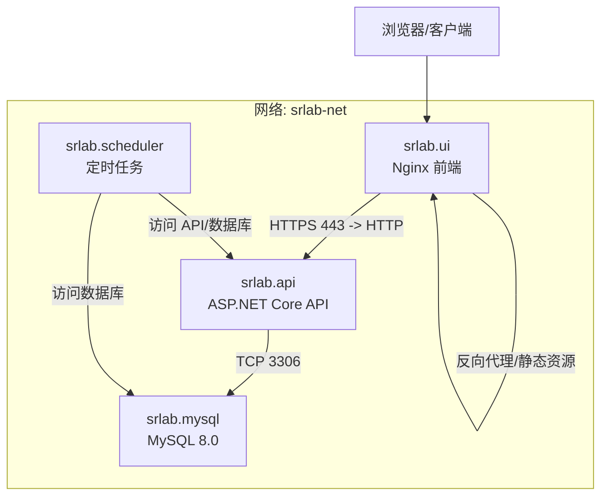
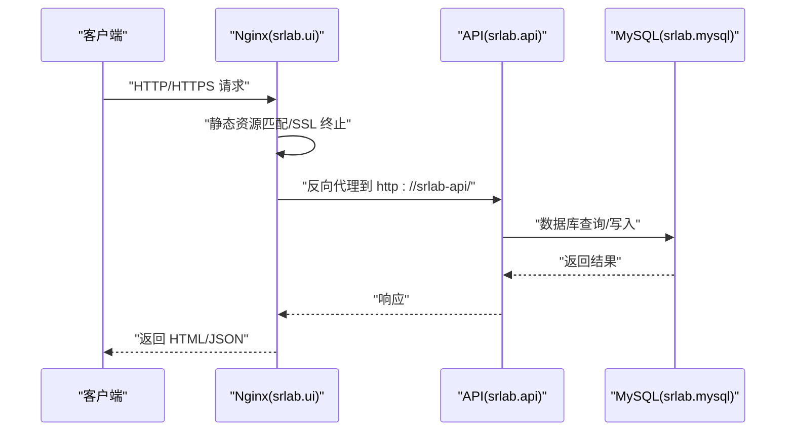
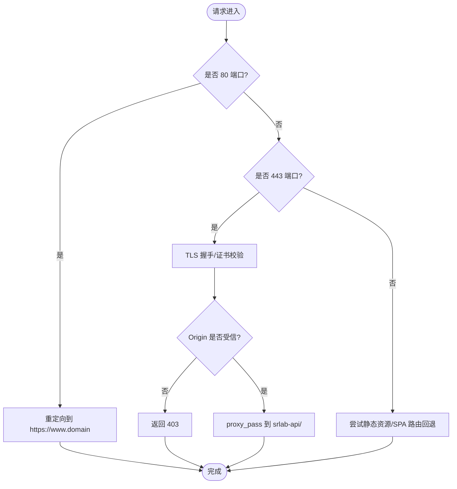
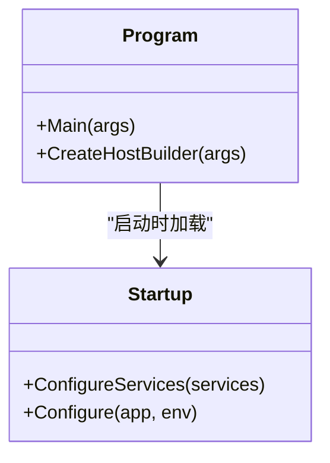
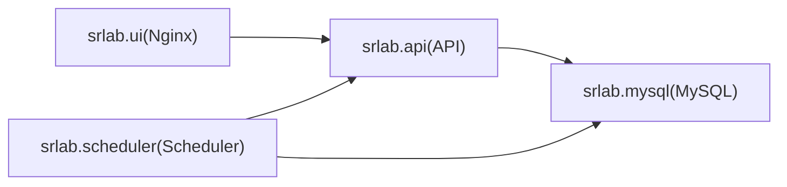

# 部署架构与容器化

<cite>
**本文引用的文件**
- [docker-compose.yml](file://docker-compose.yml)
- [API/Dockerfile](file://SpeedRunners.API/Dockerfile)
- [UI/Dockerfile](file://SpeedRunners.UI/Dockerfile)
- [UI/nginx/default.conf](file://SpeedRunners.UI/nginx/default.conf)
- [Scheduler/Dockerfile](file://SpeedRunners.Scheduler/Dockerfile)
- [Scheduler/App.config](file://SpeedRunners.Scheduler/App.config)
- [API/Program.cs](file://SpeedRunners.API/SpeedRunners/Program.cs)
- [API/Startup.cs](file://SpeedRunners.API/SpeedRunners/Startup.cs)
- [API/appsettings.json](file://SpeedRunners.API/SpeedRunners/appsettings.json)
- [UI/.env.production](file://SpeedRunners.UI/.env.production)
- [UI/package.json](file://SpeedRunners.UI/package.json)
- [API/SpeedRunners.csproj](file://SpeedRunners.API/SpeedRunners/SpeedRunners.csproj)
- [Scheduler/SpeedRunners.Scheduler.csproj](file://SpeedRunners.Scheduler/SpeedRunners.Scheduler.csproj)
- [README.md](file://README.md)
</cite>

## 目录
1. [简介](#简介)
2. [项目结构](#项目结构)
3. [核心组件](#核心组件)
4. [架构总览](#架构总览)
5. [详细组件分析](#详细组件分析)
6. [依赖关系分析](#依赖关系分析)
7. [性能考虑](#性能考虑)
8. [故障排查指南](#故障排查指南)
9. [结论](#结论)
10. [附录](#附录)

## 简介
本文件面向 SpeedRunnersLab 的容器化与部署，围绕 docker-compose 编排的完整架构进行说明，涵盖以下内容：
- 服务角色与职责：Nginx 反向代理、MySQL 数据库、ASP.NET Core API 服务、Vue.js 前端应用、定时任务调度器
- docker-compose.yml 的服务配置与网络设置，以及服务间依赖与通信机制
- Nginx 作为反向代理的作用：静态资源服务、跨域与 SSL 终止、请求转发
- 各服务的 Dockerfile 配置要点：基础镜像、环境变量、端口映射、运行入口
- 生产环境部署策略：环境配置、数据持久化、日志管理与监控建议
- 提供部署架构图与容器交互流程图，帮助快速理解与落地实施

## 项目结构
SpeedRunnersLab 采用多服务容器化架构，通过 docker-compose 将 MySQL、API、前端 UI、调度器等服务统一编排在同一自定义桥接网络中，实现服务发现与隔离。

图表来源
- [docker-compose.yml](file://docker-compose.yml#L3-L59)

章节来源
- [docker-compose.yml](file://docker-compose.yml#L1-L59)

## 核心组件
- MySQL 数据库（srlab.mysql）
  - 使用官方 MySQL 8.0.18 镜像，开放 3306 端口，设置时区为 Asia/Shanghai
  - 挂载数据目录与初始化脚本目录，确保数据持久化与首次导入
- ASP.NET Core API（srlab.api）
  - 基于 aspnet:3.1 镜像，暴露 80/443 端口，使用发布产物启动
  - 通过 extra_hosts 解析 host.docker.internal，便于开发环境调试
- Vue.js 前端（srlab.ui）
  - 基于 nginx:stable-alpine，挂载 Nginx 配置与构建产物目录
  - 对外暴露 80/443 端口，实现静态资源服务与 HTTPS 反向代理
- 定时任务调度器（srlab.scheduler）
  - 基于 runtime:3.1 镜像，使用发布产物启动
  - 通过 extra_hosts 访问宿主机网络，读取 App.config 中数据库连接与调度参数

章节来源
- [docker-compose.yml](file://docker-compose.yml#L4-L55)
- [API/Dockerfile](file://SpeedRunners.API/Dockerfile#L3-L27)
- [UI/Dockerfile](file://SpeedRunners.UI/Dockerfile#L14-L22)
- [Scheduler/Dockerfile](file://SpeedRunners.Scheduler/Dockerfile#L3-L23)

## 架构总览
下图展示容器化部署的整体交互：浏览器通过 Nginx 接入，Nginx 将 API 请求转发至 ASP.NET Core API；前端静态资源由 Nginx 提供；调度器通过 API 与数据库执行周期性任务。

图表来源
- [UI/nginx/default.conf](file://SpeedRunners.UI/nginx/default.conf#L11-L25)
- [docker-compose.yml](file://docker-compose.yml#L31-L44)

## 详细组件分析

### Nginx 反向代理与前端静态资源
- 静态资源服务
  - 挂载构建产物目录到 Nginx 默认站点根目录，实现静态资源直出
- 跨域与安全
  - 在特定 server 块内限制允许来源，提升安全性
- SSL 终止与证书
  - 443 端口监听，加载指定证书与密钥，完成 TLS 终止
- 反向代理
  - 将 / 路径代理到后端 API 服务（srlab-api），实现前后端分离

图表来源
- [UI/nginx/default.conf](file://SpeedRunners.UI/nginx/default.conf#L1-L30)

章节来源
- [UI/nginx/default.conf](file://SpeedRunners.UI/nginx/default.conf#L1-L30)
- [UI/Dockerfile](file://SpeedRunners.UI/Dockerfile#L14-L22)

### ASP.NET Core API 服务
- 运行时与端口
  - 基于 aspnet:3.1，暴露 80/443 端口，使用发布产物启动
- 日志与过滤
  - 使用 Log4Net 并对系统默认日志进行过滤，减少噪音
- CORS 与中间件
  - 注册全局 CORS 策略，启用令牌认证中间件与本地化中间件
- 配置来源
  - 通过 appsettings.json 提供数据库连接、第三方 API 密钥、刷新周期等配置

图表来源
- [API/Program.cs](file://SpeedRunners.API/SpeedRunners/Program.cs#L9-L32)
- [API/Startup.cs](file://SpeedRunners.API/SpeedRunners/Startup.cs#L33-L84)

章节来源
- [API/Dockerfile](file://SpeedRunners.API/Dockerfile#L3-L27)
- [API/Program.cs](file://SpeedRunners.API/SpeedRunners/Program.cs#L14-L32)
- [API/Startup.cs](file://SpeedRunners.API/SpeedRunners/Startup.cs#L33-L84)
- [API/appsettings.json](file://SpeedRunners.API/SpeedRunners/appsettings.json#L1-L21)

### MySQL 数据库
- 镜像与版本
  - 使用 mysql:8.0.18，设置时区与数据库名
- 数据持久化
  - 挂载 /var/lib/mysql，确保容器重启后数据不丢失
- 初始化脚本
  - 挂载初始化 SQL 目录，容器首次启动时自动执行

章节来源
- [docker-compose.yml](file://docker-compose.yml#L4-L18)

### 定时任务调度器
- 运行时与入口
  - 基于 runtime:3.1，使用发布产物启动
- 配置与参数
  - 通过 App.config 提供数据库连接、调度间隔、代理地址、API Key 等
- 网络访问
  - 通过 extra_hosts 访问宿主机网络，便于开发联调

章节来源
- [Scheduler/Dockerfile](file://SpeedRunners.Scheduler/Dockerfile#L3-L23)
- [Scheduler/App.config](file://SpeedRunners.Scheduler/App.config#L1-L14)
- [docker-compose.yml](file://docker-compose.yml#L46-L55)

### 前端构建与环境变量
- 构建产物
  - UI 使用 Nginx 提供静态资源，构建产物位于 dist 目录
- API 基址
  - .env.production 中配置 VUE_APP_BASE_API 指向 Nginx 上的 API 域名
- 构建脚本
  - package.json 提供 build:prod 等脚本，用于生成生产环境产物

章节来源
- [UI/.env.production](file://SpeedRunners.UI/.env.production#L1-L7)
- [UI/package.json](file://SpeedRunners.UI/package.json#L6-L13)
- [UI/Dockerfile](file://SpeedRunners.UI/Dockerfile#L14-L22)

## 依赖关系分析
- 网络层
  - 所有服务加入自定义桥接网络 srlab-net，实现服务发现与隔离
- 服务间依赖
  - API 依赖 MySQL（TCP 3306）
  - Nginx 依赖 API（反向代理）
  - 调度器依赖 API 与 MySQL（数据同步/更新）
- 配置耦合
  - 前端通过 .env.production 指定 API 域名
  - API 通过 appsettings.json 提供数据库与第三方密钥
  - 调度器通过 App.config 提供数据库连接与调度参数

图表来源
- [docker-compose.yml](file://docker-compose.yml#L3-L59)

章节来源
- [docker-compose.yml](file://docker-compose.yml#L3-L59)

## 性能考虑
- 静态资源优化
  - Nginx 直出静态资源，减少 API 压力；可结合缓存头与 gzip 压缩进一步优化
- 反向代理与 SSL
  - 在 Nginx 层做 SSL 终止，释放后端 API 的加密开销
- 数据库连接
  - 合理设置连接池大小与超时时间，避免并发高峰下的连接争用
- 日志与监控
  - API 使用 Log4Net 输出结构化日志，建议接入集中式日志平台
  - Nginx 开启访问日志与错误日志，配合指标采集工具进行监控

## 故障排查指南
- API 启动失败
  - 检查 appsettings.json 中数据库连接字符串与第三方密钥是否正确
  - 查看容器日志，确认 Log4Net 是否正常加载
- Nginx 无法访问 API
  - 确认 default.conf 中 proxy_pass 目标与服务名一致
  - 检查 srlab-net 网络连通性与 DNS 解析
- 数据库无数据或初始化失败
  - 确认挂载的初始化 SQL 文件是否存在且语法正确
  - 检查卷权限与时区设置
- 调度器无法连接数据库
  - 检查 App.config 中连接字符串与端口
  - 确认 extra_hosts 配置与宿主机网络可达性

章节来源
- [API/appsettings.json](file://SpeedRunners.API/SpeedRunners/appsettings.json#L13-L19)
- [UI/nginx/default.conf](file://SpeedRunners.UI/nginx/default.conf#L22-L24)
- [Scheduler/App.config](file://SpeedRunners.Scheduler/App.config#L4-L5)
- [docker-compose.yml](file://docker-compose.yml#L14-L16)

## 结论
本容器化方案以 docker-compose 实现了 Nginx、MySQL、ASP.NET Core API、Vue.js 前端与定时任务的统一编排，具备清晰的服务边界与网络隔离。通过 Nginx 的静态资源服务与反向代理，实现了前后端分离与 SSL 终止；API 侧的日志与中间件配置提供了良好的可观测性与扩展性。建议在生产环境中补充集中式日志与监控、完善的备份策略与证书轮换机制，以保障系统的稳定性与安全性。

## 附录

### docker-compose.yml 关键配置说明
- 网络与服务
  - 自定义桥接网络 srlab-net，所有服务加入该网络
- 端口映射
  - Nginx 对外映射 80/443；MySQL 映射 3306
- 卷挂载
  - MySQL 数据卷与初始化脚本卷；Nginx 配置与静态资源卷
- 环境变量与时区
  - 统一设置 Asia/Shanghai，确保日志与业务时间一致

章节来源
- [docker-compose.yml](file://docker-compose.yml#L1-L59)

### API 与调度器项目文件要点
- API 项目
  - 目标框架 netcoreapp3.1，启用 Docker 目标扩展，集成 Newtonsoft.Json 与 Log4Net
- 调度器项目
  - 目标框架 netcoreapp3.1，包含 Dapper、MySqlConnector、FluentScheduler、NLog 等依赖

章节来源
- [API/SpeedRunners.csproj](file://SpeedRunners.API/SpeedRunners/SpeedRunners.csproj#L1-L33)
- [Scheduler/SpeedRunners.Scheduler.csproj](file://SpeedRunners.Scheduler/SpeedRunners.Scheduler.csproj#L1-L29)