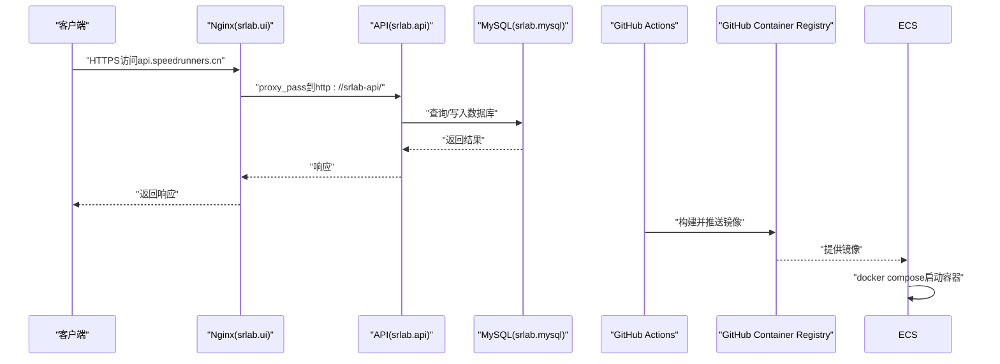
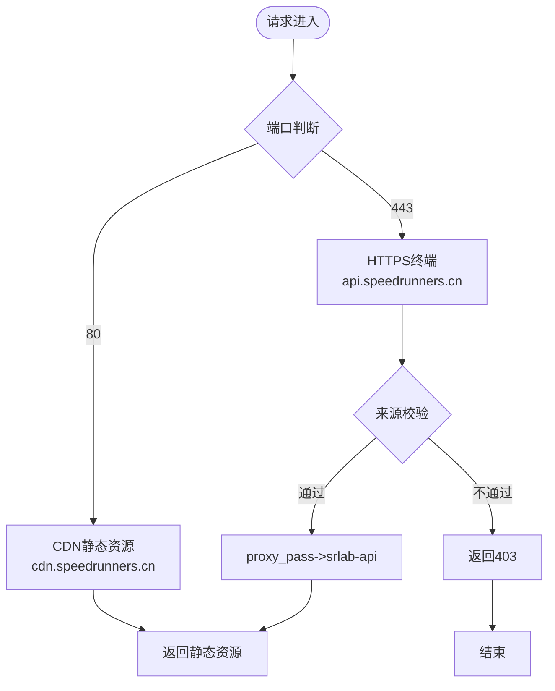
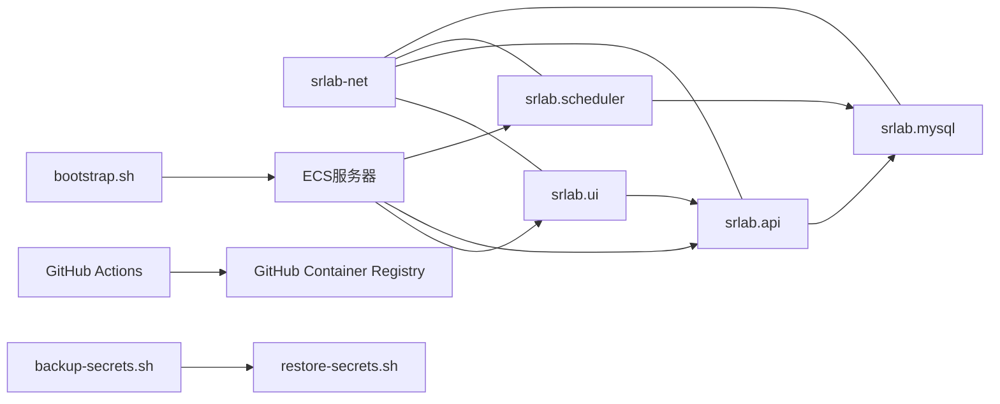

# 部署运维

<cite>
**本文引用的文件**
- [scripts/bootstrap.sh](file://scripts/bootstrap.sh)
- [scripts/backup-secrets.sh](file://scripts/backup-secrets.sh)
- [scripts/restore-secrets.sh](file://scripts/restore-secrets.sh)
- [scripts/setup-ecs.sh](file://scripts/setup-ecs.sh)
- [scripts/setup-local.ps1](file://scripts/setup-local.ps1)
- [scripts/recover.sh](file://scripts/recover.sh)
- [.github/workflows/deploy.yml](file://.github/workflows/deploy.yml)
- [docker-compose.prod.yml](file://docker-compose.prod.yml)
- [SpeedRunners.API/Dockerfile](file://SpeedRunners.API/Dockerfile)
- [SpeedRunners.UI/Dockerfile](file://SpeedRunners.UI/Dockerfile)
- [SpeedRunners.Scheduler/Dockerfile](file://SpeedRunners.Scheduler/Dockerfile)
- [SpeedRunners.API/SpeedRunners/appsettings.Production.json](file://SpeedRunners.API/SpeedRunners/appsettings.Production.json)
- [SpeedRunners.Scheduler/App.config](file://SpeedRunners.Scheduler/App.config)
- [SpeedRunners.UI/nginx/default.conf](file://SpeedRunners.UI/nginx/default.conf)
- [SpeedRunners.UI/.dockerignore](file://SpeedRunners.UI/.dockerignore)
- [.gitignore](file://.gitignore)
- [docker-compose.yml](file://docker-compose.yml)
</cite>

## 更新摘要
**变更内容**
- 新增完整自动化部署脚本套件：bootstrap.sh（一键部署新ECS实例）、backup-secrets.sh（加密备份敏感生产数据）、restore-secrets.sh（安全恢复敏感文件）
- 基础设施配置改进：.gitignore文件扩展以包含.crt证书文件和迁移备份包，Nginx配置更新为引用.crt证书文件而非.pem文件
- CI/CD流程优化：完全移除阿里云ACR依赖，实现从阿里云到GitHub Container Registry (ghcr.io)的无缝迁移
- 恢复脚本增强：提供幂等恢复功能，支持快速重建ECS环境
- **更新** GitHub Actions部署脚本优化：改进git fetch命令，提升部署流程的灵活性和维护性

## 目录
1. [简介](#简介)
2. [项目结构](#项目结构)
3. [核心组件](#核心组件)
4. [架构总览](#架构总览)
5. [详细组件分析](#详细组件分析)
6. [依赖关系分析](#依赖关系分析)
7. [性能与可用性](#性能与可用性)
8. [故障排查指南](#故障排查指南)
9. [结论](#结论)
10. [附录](#附录)

## 简介
本文件面向DevOps工程师与系统管理员，提供SpeedRunnersLab的容器化部署与运维实践指南。内容覆盖Docker容器化与docker-compose编排、Nginx反向代理与负载均衡策略、生产环境部署流程、环境变量与secrets管理、监控与日志、性能与健康检查、数据库备份与版本升级回滚、以及自动化部署与运维脚本使用建议。

**更新** 项目已完成从阿里云ACR到GitHub Container Registry (ghcr.io)的全面迁移，新增完整自动化部署脚本套件，提供生产环境部署迁移的完整解决方案，包括一键部署、加密备份、安全恢复等功能。GitHub Actions部署脚本已优化git fetch命令，进一步提升部署流程的灵活性和维护性。

## 项目结构
- 后端API：ASP.NET Core应用，通过Dockerfile构建镜像并由docker-compose编排运行。
- 前端UI：Vue应用，构建产物置于Nginx容器中提供静态服务。
- 调度任务：独立的.NET Core运行时应用，用于定时任务与数据同步。
- 数据库：MySQL 8.0，初始化脚本位于mysql-dump目录，持久化存储于宿主机目录。
- 反向代理：Nginx提供HTTPS终端、CORS白名单校验与到后端API的反代。
- 自动化部署：通过GitHub Actions实现CI/CD，支持一键部署到ECS服务器。
- 恢复脚本：提供幂等恢复功能，支持快速重建ECS环境。
- **新增** 自动化部署脚本套件：bootstrap.sh一键部署、backup-secrets.sh加密备份、restore-secrets.sh安全恢复。

```mermaid
graph TB
subgraph "网络"
NET["srlab-net桥接网络"]
end
subgraph "前端"
UI["srlab.ui<br/>Nginx静态站点"]
end
subgraph "后端"
API["srlab.api<br/>ASP.NET Core"]
SCHED["srlab.scheduler<br/>.NET调度器"]
end
subgraph "数据"
MYSQL["srlab.mysql<br/>MySQL 8.0"]
end
subgraph "CI/CD"
GHA["GitHub Actions<br/>自动构建与部署"]
GHCR["GitHub Container Registry<br/>ghcr.io镜像仓库"]
ECS["ECS服务器<br/>生产环境"]
END
UI --> |"HTTP/HTTPS"| API
API --> |"TCP 3306"| MYSQL
SCHED --> |"TCP 3306"| MYSQL
NET --- UI
NET --- API
NET --- SCHED
NET --- MYSQL
GHA --> |"推送到"| GHCR
ECS --> |"拉取镜像"| GHCR
ECS --> |"部署"| UI
ECS --> |"部署"| API
ECS --> |"部署"| SCHED
```

**章节来源**
- [scripts/bootstrap.sh:1-90](file://scripts/bootstrap.sh#L1-L90)
- [scripts/backup-secrets.sh:1-66](file://scripts/backup-secrets.sh#L1-L66)
- [scripts/restore-secrets.sh:1-57](file://scripts/restore-secrets.sh#L1-L57)
- [scripts/setup-ecs.sh:1-146](file://scripts/setup-ecs.sh#L1-L146)
- [.github/workflows/deploy.yml:1-143](file://.github/workflows/deploy.yml#L1-L143)

## 核心组件
- srlab.mysql
  - 镜像：mysql:8.0.18
  - 端口映射：3306:3306
  - 初始化：挂载mysql-dump目录作为初始化SQL
  - 存储：挂载./mysql到/var/lib/mysql
  - 环境：ROOT密码、数据库名、时区
- srlab.api
  - 镜像：ghcr.io/${GHCR_OWNER}/srlab-api:${IMAGE_TAG:-latest}
  - 入口：dotnet SpeedRunners.dll
  - 网络：加入srlab-net
  - 主机名：通过extra_hosts解析host.docker.internal
  - 配置：挂载生产环境配置文件
- srlab.ui
  - 镜像：ghcr.io/${GHCR_OWNER}/srlab-ui:${IMAGE_TAG:-latest}
  - 端口：80/443映射到宿主机
  - 卷：挂载Nginx配置与前端dist目录
  - 反代：将api.speedrunners.cn反代至srlab-api
  - **更新** 证书配置：使用.crt证书文件而非.pem文件
- srlab.scheduler
  - 镜像：ghcr.io/${GHCR_OWNER}/srlab-scheduler:${IMAGE_TAG:-latest}
  - 入口：dotnet SpeedRunners.Scheduler.dll
  - 网络：加入srlab-net
  - 主机名：通过extra_hosts解析host.docker.internal
  - 配置：挂载App.config配置文件

**章节来源**
- [docker-compose.prod.yml:12-75](file://docker-compose.prod.yml#L12-L75)
- [SpeedRunners.API/Dockerfile:1-32](file://SpeedRunners.API/Dockerfile#L1-L32)
- [SpeedRunners.UI/Dockerfile:1-29](file://SpeedRunners.UI/Dockerfile#L1-L29)
- [SpeedRunners.Scheduler/Dockerfile:1-24](file://SpeedRunners.Scheduler/Dockerfile#L1-L24)
- [SpeedRunners.UI/nginx/default.conf:15-16](file://SpeedRunners.UI/nginx/default.conf#L15-L16)

## 架构总览
- 外部访问通过Nginx接收HTTP/HTTPS请求，HTTPS证书由UI侧Nginx提供。
- Nginx对api.speedrunners.cn域名进行反向代理，转发到srlab-api。
- srlab.api通过连接字符串访问srlab.mysql。
- srlab.scheduler以独立容器运行，按计划执行任务（如从Steam拉取数据）。
- GitHub Actions实现自动化构建和部署，支持一键部署到ECS服务器。
- 使用GitHub Container Registry (ghcr.io)作为镜像仓库，无需阿里云ACR。
- **新增** 自动化部署脚本套件提供完整的生产环境部署迁移解决方案。



**图表来源**
- [SpeedRunners.UI/nginx/default.conf:1-30](file://SpeedRunners.UI/nginx/default.conf#L1-L30)
- [.github/workflows/deploy.yml:1-143](file://.github/workflows/deploy.yml#L1-L143)
- [scripts/bootstrap.sh:1-90](file://scripts/bootstrap.sh#L1-L90)

**章节来源**
- [SpeedRunners.UI/nginx/default.conf:1-30](file://SpeedRunners.UI/nginx/default.conf#L1-L30)
- [.github/workflows/deploy.yml:1-143](file://.github/workflows/deploy.yml#L1-L143)
- [scripts/bootstrap.sh:1-90](file://scripts/bootstrap.sh#L1-L90)

## 详细组件分析

### Nginx反向代理与负载均衡
- 80端口监听，server_name为cdn.speedrunners.cn，提供静态资源。
- 443端口监听，server_name为api.speedrunners.cn，启用SSL并校验来源域名白名单。
- **更新** 证书配置：使用/api.speedrunners.cn.crt和/api.speedrunners.cn.key文件，而非.pem格式。
- 反向代理到srlab-api，实现前后端分离。
- 负载均衡：当前compose文件未定义多实例，若需横向扩展，可在上游接入HAProxy/LB或使用Docker Swarm/K8s实现多副本与服务发现。



**图表来源**
- [SpeedRunners.UI/nginx/default.conf:1-30](file://SpeedRunners.UI/nginx/default.conf#L1-L30)

**章节来源**
- [SpeedRunners.UI/nginx/default.conf:1-30](file://SpeedRunners.UI/nginx/default.conf#L1-L30)

### 自动化部署脚本套件
- **bootstrap.sh**：一键部署新ECS实例的完整入口脚本，串起项目初始化、secrets恢复、启动容器三个步骤。
  - 支持两种模式：含备份恢复（推荐）和无备份仅项目部署
  - 自动检查docker、git、curl环境并启动docker服务
  - 调用setup-ecs.sh进行项目初始化
  - 可选地调用restore-secrets.sh恢复敏感配置
  - 拉取镜像并启动容器，显示容器状态
- **backup-secrets.sh**：在旧ECS上加密备份所有敏感生产数据
  - 备份范围：acme.sh证书状态、七牛云部署脚本、appsettings.Production.json、App.config、SSL证书、.env文件
  - 输出：/root/srlab-secrets-bak-YYYYMMDD-HHMMSS.tar.gz
  - 安全提示：包含明文敏感信息，scp到新机后立即删除
- **restore-secrets.sh**：在新ECS上安全恢复备份包
  - 解包到根目录原位置
  - 重建acme.sh cron任务（每天5:00自动续期）
  - 验证证书、配置文件完整性
  - 提示删除备份包

**新增** 自动化部署脚本套件提供了生产环境部署迁移的完整解决方案。

**章节来源**
- [scripts/bootstrap.sh:1-90](file://scripts/bootstrap.sh#L1-L90)
- [scripts/backup-secrets.sh:1-66](file://scripts/backup-secrets.sh#L1-L66)
- [scripts/restore-secrets.sh:1-57](file://scripts/restore-secrets.sh#L1-L57)

### API应用配置与连接
- 连接字符串：在生产环境配置中定义，指向srlab.mysql。
- 日志级别：默认信息级别，可按需调整。
- 代理开关与地址：支持启用内部代理，便于开发或受限网络环境。
- 第三方密钥：Steam API Key、七牛云AccessKey/SecretKey等，建议通过secrets管理。
- 生产环境配置：通过挂载appsettings.Production.json文件提供敏感配置。

**章节来源**
- [SpeedRunners.API/SpeedRunners/appsettings.Production.json:1-23](file://SpeedRunners.API/SpeedRunners/appsettings.Production.json#L1-L23)

### 调度器配置
- 数据库连接：通过App.config中的ConnectionString指向外部MySQL。
- 任务参数：包括更新周期、是否启用特定功能等。
- 代理与API Key：可配置代理地址与接口密钥。
- 配置管理：通过挂载App.config文件提供运行时配置。

**章节来源**
- [SpeedRunners.Scheduler/App.config:1-14](file://SpeedRunners.Scheduler/App.config#L1-L14)

### 前端构建与运行
- 使用多阶段Dockerfile构建，CI在镜像中完成构建过程。
- 使用Nginx镜像提供静态资源服务。
- 生产环境基础API地址指向api.speedrunners.cn。
- **更新** 证书配置：确保证书与私钥正确挂载到Nginx配置指定路径，使用.crt文件格式。

**章节来源**
- [SpeedRunners.UI/Dockerfile:1-29](file://SpeedRunners.UI/Dockerfile#L1-L29)
- [SpeedRunners.UI/.dockerignore:1-19](file://SpeedRunners.UI/.dockerignore#L1-L19)

### 数据库初始化与持久化
- 初始化：首次启动时会执行mysql-dump目录下的SQL文件。
- 持久化：/var/lib/mysql挂载到宿主机./mysql，避免容器删除导致数据丢失。

**章节来源**
- [docker-compose.prod.yml:22-26](file://docker-compose.prod.yml#L22-L26)

### 自动化部署与CI/CD流程
- GitHub Actions工作流：实现三步构建和部署流程。
- 镜像构建：API、UI、Scheduler三个组件并行构建。
- 镜像推送：推送到GitHub Container Registry (ghcr.io)私有仓库。
- ECS部署：通过SSH连接到ECS服务器，拉取镜像并启动容器。
- 版本控制：支持使用Git短SHA作为镜像标签。
- **更新** CI/CD流水线已完全迁移到ghcr.io，移除了阿里云ACR相关配置，使用GitHub Token进行镜像仓库认证。
- **更新** GitHub Actions部署脚本优化：改进git fetch命令，使用更精确的refspec语法，提升部署流程的灵活性和维护性。

**章节来源**
- [.github/workflows/deploy.yml:1-143](file://.github/workflows/deploy.yml#L1-L143)

### ECS服务器初始化脚本
- 自动化配置：将服务器改造成可被CI自动部署的状态。
- 环境准备：安装Docker、Git，配置docker compose v2。
- ghcr.io登录：自动配置GitHub Container Registry认证。
- 配置检查：检查敏感配置文件是否存在。
- 一键部署：支持在线执行脚本完成初始化。
- **更新** 初始化脚本已完全适配ghcr.io方案，移除了阿里云相关配置步骤。

**章节来源**
- [scripts/setup-ecs.sh:1-146](file://scripts/setup-ecs.sh#L1-L146)

### 本地开发环境配置脚本
- SSH密钥生成：生成专用部署SSH密钥对。
- 公钥配置：将公钥复制到剪贴板，便于粘贴到ECS。
- ECS连接测试：自动测试SSH连通性。
- GitHub Secrets管理：自动写入或指导手动配置Secrets。
- **更新** 本地配置脚本已完全迁移到ghcr.io方案，移除了阿里云ACR配置步骤。

**章节来源**
- [scripts/setup-local.ps1:1-174](file://scripts/setup-local.ps1#L1-L174)

### 幂等恢复脚本
- 功能特性：提供幂等恢复功能，可将ECS环境强制对齐到GitHub master。
- 自动化流程：自动检测和安装docker compose v2，写入.env配置。
- 安全备份：在强制对齐前备份冲突文件到独立目录。
- 环境检查：检查敏感配置文件是否存在，确保部署安全。
- 一键恢复：支持快速恢复ECS环境到最新状态。
- **更新** 恢复脚本是本次更新的重要新增功能，提供强大的环境恢复能力。

**章节来源**
- [scripts/recover.sh:1-87](file://scripts/recover.sh#L1-L87)

## 依赖关系分析
- srlab.api依赖srlab.mysql（TCP 3306）。
- srlab.scheduler依赖srlab.mysql（TCP 3306）。
- srlab.ui依赖srlab.api（通过Nginx反代）。
- 所有服务均加入srlab-net桥接网络，便于容器间通信。
- GitHub Actions依赖GitHub Container Registry (ghcr.io)和ECS服务器。
- **更新** 依赖关系已完全迁移到ghcr.io，移除了阿里云ACR依赖。



**图表来源**
- [docker-compose.prod.yml:1-75](file://docker-compose.prod.yml#L1-L75)
- [.github/workflows/deploy.yml:1-143](file://.github/workflows/deploy.yml#L1-L143)
- [scripts/bootstrap.sh:1-90](file://scripts/bootstrap.sh#L1-L90)
- [scripts/backup-secrets.sh:1-66](file://scripts/backup-secrets.sh#L1-L66)
- [scripts/restore-secrets.sh:1-57](file://scripts/restore-secrets.sh#L1-L57)

**章节来源**
- [docker-compose.prod.yml:1-75](file://docker-compose.prod.yml#L1-L75)
- [.github/workflows/deploy.yml:1-143](file://.github/workflows/deploy.yml#L1-L143)
- [scripts/bootstrap.sh:1-90](file://scripts/bootstrap.sh#L1-L90)
- [scripts/backup-secrets.sh:1-66](file://scripts/backup-secrets.sh#L1-L66)
- [scripts/restore-secrets.sh:1-57](file://scripts/restore-secrets.sh#L1-L57)

## 性能与可用性
- 健康检查
  - 建议为srlab.api添加HTTP健康检查端点（如/health），返回200表示健康。
  - 为srlab.mysql添加数据库连通性检查。
- 资源限制
  - 为各服务设置CPU/内存限制，避免资源争抢。
- 负载均衡
  - 当前compose未启用多实例；若需高可用，建议引入反向代理层（如HAProxy/Nginx Plus）或容器编排平台实现多副本与自动扩缩容。
- 缓存与静态资源
  - Nginx层面开启Gzip/缓存头，提升静态资源加载性能。
- 日志与追踪
  - API使用日志配置，建议统一输出到stdout/stderr，并结合集中式日志系统采集。
  - 调度器日志可通过容器日志采集。
- 自动化部署
  - GitHub Actions提供快速部署能力，支持回滚到指定版本。
  - **更新** 自动化部署脚本套件提供更灵活的部署选项。
- 恢复能力
  - 恢复脚本提供幂等恢复功能，支持快速重建ECS环境。
  - **更新** 新增的备份恢复脚本提供完整的灾难恢复方案。

**更新** 新增恢复脚本增强了系统的可用性和故障恢复能力。

## 故障排查指南
- 无法访问API
  - 检查srlab.ui是否正确将api.speedrunners.cn反代到srlab-api。
  - 检查srlab.api是否正常启动且监听80/443。
- 数据库连接失败
  - 确认srlab.mysql已就绪，连接字符串正确，且srlab.api/srlab.scheduler可解析到srlab.mysql。
- CORS/来源校验失败
  - Nginx对api.speedrunners.cn的来源域名做了白名单校验，确保前端来源符合要求。
- 证书问题
  - **更新** 确保/etc/nginx/conf.d/api.speedrunners.cn.crt和.key文件正确挂载并可读。
  - 检查.gitignore中是否正确排除了.crt和.key文件。
- 日志定位
  - 查看对应容器日志，确认错误堆栈与异常时间点。
- CI/CD部署失败
  - 检查GitHub Actions Secrets配置是否正确。
  - 确认ECS服务器SSH连接正常。
  - 验证GitHub Token权限配置。
- ECS初始化失败
  - 检查工作目录是否为/root/home/srlab。
  - 确认Docker和Git已正确安装。
  - 验证ghcr.io认证配置。
- 恢复脚本执行失败
  - 检查.env文件中的GHCR_OWNER和IMAGE_TAG配置。
  - 确认敏感配置文件存在且可读。
  - 验证docker compose v2安装状态。
- **新增** 自动化部署脚本故障排查
  - bootstrap.sh：检查备份包路径、Docker环境、网络连通性。
  - backup-secrets.sh：确认备份包输出路径、权限设置。
  - restore-secrets.sh：验证crontab配置、证书文件完整性。
- **更新** GitHub Actions部署脚本故障排查
  - 检查git fetch命令的refspec语法是否正确
  - 确认origin远程仓库配置正确
  - 验证分支跟踪设置是否完整

**更新** 故障排查指南已更新，增加了恢复脚本和自动化部署脚本相关的故障排查步骤。

**章节来源**
- [SpeedRunners.UI/nginx/default.conf:18-20](file://SpeedRunners.UI/nginx/default.conf#L18-L20)
- [scripts/setup-ecs.sh:114-136](file://scripts/setup-ecs.sh#L114-L136)
- [scripts/recover.sh:1-87](file://scripts/recover.sh#L1-L87)
- [scripts/bootstrap.sh:1-90](file://scripts/bootstrap.sh#L1-L90)
- [scripts/backup-secrets.sh:1-66](file://scripts/backup-secrets.sh#L1-L66)
- [scripts/restore-secrets.sh:1-57](file://scripts/restore-secrets.sh#L1-L57)

## 结论
本方案采用docker-compose将前端、后端、调度器与数据库解耦编排，配合Nginx提供反向代理与静态资源服务。通过GitHub Actions实现自动化CI/CD，支持一键部署到ECS服务器。项目已完成从阿里云ACR到GitHub Container Registry (ghcr.io)的全面迁移，新增完整自动化部署脚本套件提供生产环境部署迁移的完整解决方案，包括一键部署、加密备份、安全恢复等功能。生产环境建议补充secrets管理、集中日志、健康检查、负载均衡与多副本部署，并完善数据库备份与版本升级回滚流程，以满足高可用与可维护性需求。

**更新** 项目已完全适配ghcr.io方案，提供更完善的自动化部署与运维能力，包括恢复脚本支持和完整的生产环境迁移解决方案。GitHub Actions部署脚本的git fetch命令优化进一步提升了部署流程的灵活性和维护性。

## 附录

### A. 生产环境部署流程
- 准备阶段
  - 准备secrets：数据库密码、第三方API Key、SSL证书与私钥。
  - 准备持久化卷：确保./mysql与Nginx配置卷存在。
  - 配置GitHub Container Registry：使用GitHub Token进行镜像仓库认证。
- 部署步骤
  - 使用docker-compose在目标主机拉起全部服务。
  - 验证Nginx反代与证书生效。
  - 验证API健康与数据库连通。
  - 验证调度器任务是否按预期执行。
- 回滚策略
  - 保留上一版本镜像标签，必要时回退到历史版本。
  - 如需回滚数据库，使用备份快照恢复。
- **新增** 自动化部署流程
  - 使用bootstrap.sh一键部署新ECS实例
  - 使用backup-secrets.sh加密备份敏感数据
  - 使用restore-secrets.sh安全恢复备份包

**更新** 部署流程已完全迁移到ghcr.io方案，移除了阿里云相关配置。

**章节来源**
- [docker-compose.prod.yml:1-75](file://docker-compose.prod.yml#L1-L75)
- [scripts/bootstrap.sh:1-90](file://scripts/bootstrap.sh#L1-L90)
- [scripts/backup-secrets.sh:1-66](file://scripts/backup-secrets.sh#L1-L66)
- [scripts/restore-secrets.sh:1-57](file://scripts/restore-secrets.sh#L1-L57)

### B. 环境变量与secrets管理
- 建议使用GitHub Actions Secrets管理敏感信息。
- 示例字段（请勿直接复制值）：
  - GHCR_OWNER：GitHub用户名/组织名（小写）
  - IMAGE_TAG：镜像标签，如latest或a1b2c3d
  - SSH_HOST：ECS服务器地址
  - SSH_PRIVATE_KEY：SSH私钥
- 生产环境配置：数据库密码、Steam API Key、七牛云AccessKey/SecretKey等。
- **更新** 移除了阿里云相关配置字段，新增ghcr.io相关环境变量说明。

**章节来源**
- [scripts/setup-local.ps1:121-155](file://scripts/setup-local.ps1#L121-L155)
- [SpeedRunners.API/SpeedRunners/appsettings.Production.json:13-21](file://SpeedRunners.API/SpeedRunners/appsettings.Production.json#L13-L21)

### C. 监控与告警
- 指标采集
  - 容器资源：CPU/内存/IO
  - 应用指标：API响应时间、错误率、数据库连接数
- 日志采集
  - 统一输出到stdout/stderr，使用集中式日志系统（如ELK/Fluent Bit/Loki）采集。
- 告警策略
  - 健康检查失败、错误率突增、数据库不可用、磁盘空间不足等触发告警。

### D. 数据库备份与版本升级
- 备份
  - 使用mysqldump或Percona XtraBackup定期备份。
  - 将备份归档至对象存储或本地冷存储。
- 升级与回滚
  - 升级前先备份；升级后验证业务可用性。
  - 回滚时使用最近一次可用备份恢复。

### E. 自动化部署与运维脚本
- GitHub Actions
  - 使用.github/workflows/deploy.yml管理服务生命周期。
  - 支持手动触发和版本回滚。
- CI/CD
  - 在流水线中完成构建、推送镜像、拉起新版本、健康检查、滚动回滚。
- 运维脚本建议
  - 备份脚本：定期执行数据库备份。
  - 健康巡检脚本：检查容器状态、端口可达性、数据库连通性。
  - 日志巡检脚本：抓取异常日志并上报。
  - 恢复脚本：使用recover.sh进行环境幂等恢复。
  - **新增** 自动化部署脚本：bootstrap.sh一键部署、backup-secrets.sh加密备份、restore-secrets.sh安全恢复。
- ECS初始化脚本
  - 自动化配置ECS服务器环境。
  - 安装Docker、Git，配置docker compose v2。
  - 登录ghcr.io，检查敏感配置文件。
- 本地配置脚本
  - 自动生成SSH密钥对。
  - 配置GitHub Secrets。
  - 测试SSH连通性。

**更新** 新增恢复脚本功能，提供完整的环境恢复能力。

**章节来源**
- [.github/workflows/deploy.yml:1-143](file://.github/workflows/deploy.yml#L1-L143)
- [scripts/setup-ecs.sh:1-146](file://scripts/setup-ecs.sh#L1-L146)
- [scripts/setup-local.ps1:1-174](file://scripts/setup-local.ps1#L1-L174)
- [scripts/recover.sh:1-87](file://scripts/recover.sh#L1-L87)
- [scripts/bootstrap.sh:1-90](file://scripts/bootstrap.sh#L1-L90)
- [scripts/backup-secrets.sh:1-66](file://scripts/backup-secrets.sh#L1-L66)
- [scripts/restore-secrets.sh:1-57](file://scripts/restore-secrets.sh#L1-L57)

### F. 安全模型
- GitHub Actions Secrets：加密存储，公开仓库别人也读不到。
- 私有ghcr.io：镜像在GitHub Container Registry中，需要GitHub Token认证。
- 敏感配置只在ECS本地：appsettings.Production.json等永不进镜像、永不进git。
- SSH密钥管理：专用部署密钥，权限最小化。
- 恢复脚本安全：提供幂等恢复，避免重复部署风险。
- **新增** 加密备份安全：backup-secrets.sh输出的备份包包含明文敏感信息，必须scp到新机后立即删除，防止泄露。
- **更新** 证书文件安全：.gitignore已正确排除.crt、.key、.pem文件，确保证书不会意外提交到版本库。
- **更新** Git操作安全：使用精确的refspec语法确保分支引用正确创建，提升部署流程的可靠性。

**更新** 安全模型已更新，反映ghcr.io方案的安全特性。

**章节来源**
- [docker-compose.prod.yml:36-37](file://docker-compose.prod.yml#L36-L37)
- [scripts/recover.sh:19-27](file://scripts/recover.sh#L19-L27)
- [scripts/backup-secrets.sh:1-66](file://scripts/backup-secrets.sh#L1-L66)
- [.gitignore:31-40](file://.gitignore#L31-L40)