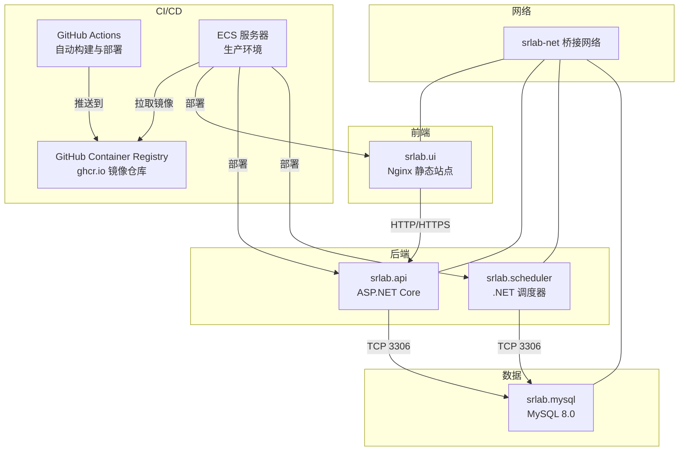
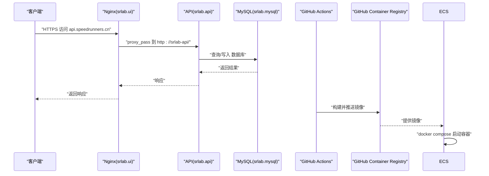
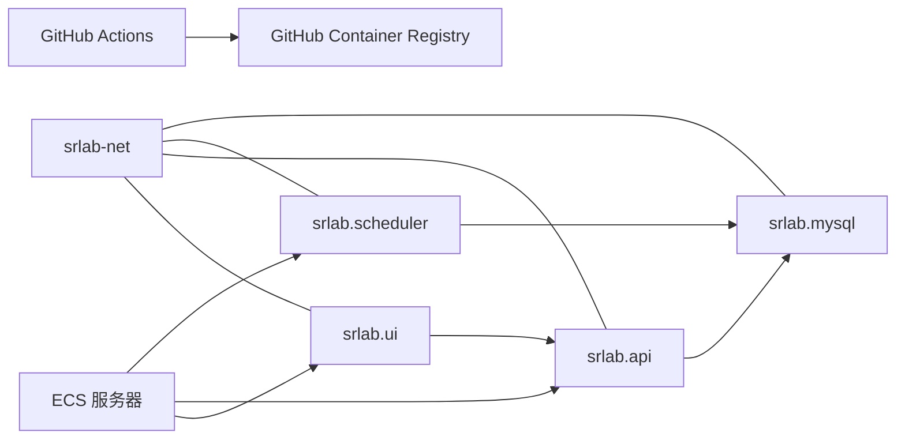

# 部署运维

<cite>
**本文引用的文件**
- [scripts/setup-ecs.sh](file://scripts/setup-ecs.sh)
- [scripts/setup-local.ps1](file://scripts/setup-local.ps1)
- [scripts/recover.sh](file://scripts/recover.sh)
- [.github/workflows/deploy.yml](file://.github/workflows/deploy.yml)
- [docker-compose.prod.yml](file://docker-compose.prod.yml)
- [SpeedRunners.API/Dockerfile](file://SpeedRunners.API/Dockerfile)
- [SpeedRunners.UI/Dockerfile](file://SpeedRunners.UI/Dockerfile)
- [SpeedRunners.Scheduler/Dockerfile](file://SpeedRunners.Scheduler/Dockerfile)
- [SpeedRunners.API/SpeedRunners/appsettings.Production.json](file://SpeedRunners.API/SpeedRunners/appsettings.Production.json)
- [SpeedRunners.Scheduler/App.config](file://SpeedRunners.Scheduler/App.config)
- [SpeedRunners.UI/nginx/default.conf](file://SpeedRunners.UI/nginx/default.conf)
- [SpeedRunners.UI/.dockerignore](file://SpeedRunners.UI/.dockerignore)
- [docker-compose.yml](file://docker-compose.yml)
</cite>

## 更新摘要
**变更内容**
- 部署架构从阿里云 ACR 迁移到 GitHub Container Registry (ghcr.io)
- 新增幂等恢复脚本 `recover.sh` 支持 ECS 环境快速恢复
- 更新 CI/CD 流水线配置，移除阿里云相关依赖
- 优化 ECS 服务器初始化脚本，适配新的 ghcr.io 方案
- 更新本地开发环境配置脚本，移除阿里云配置步骤

## 目录
1. [简介](#简介)
2. [项目结构](#项目结构)
3. [核心组件](#核心组件)
4. [架构总览](#架构总览)
5. [详细组件分析](#详细组件分析)
6. [依赖关系分析](#依赖关系分析)
7. [性能与可用性](#性能与可用性)
8. [故障排查指南](#故障排查指南)
9. [结论](#结论)
10. [附录](#附录)

## 简介
本文件面向 DevOps 工程师与系统管理员，提供 SpeedRunnersLab 的容器化部署与运维实践指南。内容覆盖 Docker 容器化与 docker-compose 编排、Nginx 反向代理与负载均衡策略、生产环境部署流程、环境变量与 secrets 管理、监控与日志、性能与健康检查、数据库备份与版本升级回滚、以及自动化部署与运维脚本使用建议。

**更新** 项目已完成从阿里云 ACR 到 GitHub Container Registry (ghcr.io) 的全面迁移，新增幂等恢复脚本支持，提供更完善的自动化部署与运维能力。

## 项目结构
- 后端 API：ASP.NET Core 应用，通过 Dockerfile 构建镜像并由 docker-compose 编排运行。
- 前端 UI：Vue 应用，构建产物置于 Nginx 容器中提供静态服务。
- 调度任务：独立的 .NET Core 运行时应用，用于定时任务与数据同步。
- 数据库：MySQL 8.0，初始化脚本位于 mysql-dump 目录，持久化存储于宿主机目录。
- 反向代理：Nginx 提供 HTTPS 终端、CORS 白名单校验与到后端 API 的反代。
- 自动化部署：通过 GitHub Actions 实现 CI/CD，支持一键部署到 ECS 服务器。
- 恢复脚本：提供幂等恢复功能，支持快速重建 ECS 环境。

**图表来源**
- [scripts/setup-ecs.sh:1-146](file://scripts/setup-ecs.sh#L1-L146)
- [.github/workflows/deploy.yml:1-143](file://.github/workflows/deploy.yml#L1-L143)

**章节来源**
- [scripts/setup-ecs.sh:1-146](file://scripts/setup-ecs.sh#L1-L146)
- [.github/workflows/deploy.yml:1-143](file://.github/workflows/deploy.yml#L1-L143)

## 核心组件
- srlab.mysql
  - 镜像：mysql:8.0.18
  - 端口映射：3306:3306
  - 初始化：挂载 mysql-dump 目录作为初始化 SQL
  - 存储：挂载 ./mysql 到 /var/lib/mysql
  - 环境：ROOT 密码、数据库名、时区
- srlab.api
  - 镜像：ghcr.io/${GHCR_OWNER}/srlab-api:${IMAGE_TAG:-latest}
  - 入口：dotnet SpeedRunners.dll
  - 网络：加入 srlab-net
  - 主机名：通过 extra_hosts 解析 host.docker.internal
  - 配置：挂载生产环境配置文件
- srlab.ui
  - 镜像：ghcr.io/${GHCR_OWNER}/srlab-ui:${IMAGE_TAG:-latest}
  - 端口：80/443 映射到宿主机
  - 卷：挂载 Nginx 配置与前端 dist 目录
  - 反代：将 api.speedrunners.cn 反代至 srlab-api
- srlab.scheduler
  - 镜像：ghcr.io/${GHCR_OWNER}/srlab-scheduler:${IMAGE_TAG:-latest}
  - 入口：dotnet SpeedRunners.Scheduler.dll
  - 网络：加入 srlab-net
  - 主机名：通过 extra_hosts 解析 host.docker.internal
  - 配置：挂载 App.config 配置文件

**章节来源**
- [docker-compose.prod.yml:12-75](file://docker-compose.prod.yml#L12-L75)
- [SpeedRunners.API/Dockerfile:1-32](file://SpeedRunners.API/Dockerfile#L1-L32)
- [SpeedRunners.UI/Dockerfile:1-29](file://SpeedRunners.UI/Dockerfile#L1-L29)
- [SpeedRunners.Scheduler/Dockerfile:1-24](file://SpeedRunners.Scheduler/Dockerfile#L1-L24)

## 架构总览
- 外部访问通过 Nginx 接收 HTTP/HTTPS 请求，HTTPS 证书由 UI 侧 Nginx 提供。
- Nginx 对 api.speedrunners.cn 域名进行反向代理，转发到 srlab-api。
- srlab.api 通过连接字符串访问 srlab.mysql。
- srlab.scheduler 以独立容器运行，按计划执行任务（如从 Steam 拉取数据）。
- GitHub Actions 实现自动化构建和部署，支持一键部署到 ECS 服务器。
- 使用 GitHub Container Registry (ghcr.io) 作为镜像仓库，无需阿里云 ACR。

**图表来源**
- [SpeedRunners.UI/nginx/default.conf:1-30](file://SpeedRunners.UI/nginx/default.conf#L1-L30)
- [.github/workflows/deploy.yml:1-143](file://.github/workflows/deploy.yml#L1-L143)

**章节来源**
- [SpeedRunners.UI/nginx/default.conf:1-30](file://SpeedRunners.UI/nginx/default.conf#L1-L30)
- [.github/workflows/deploy.yml:1-143](file://.github/workflows/deploy.yml#L1-L143)

## 详细组件分析

### Nginx 反向代理与负载均衡
- 80 端口监听，server_name 为 cdn.speedrunners.cn，提供静态资源。
- 443 端口监听，server_name 为 api.speedrunners.cn，启用 SSL 并校验来源域名白名单。
- 反向代理到 srlab-api，实现前后端分离。
- 负载均衡：当前 compose 文件未定义多实例，若需横向扩展，可在上游接入 HAProxy/LB 或使用 Docker Swarm/K8s 实现多副本与服务发现。

**图表来源**
- [SpeedRunners.UI/nginx/default.conf:1-30](file://SpeedRunners.UI/nginx/default.conf#L1-L30)

**章节来源**
- [SpeedRunners.UI/nginx/default.conf:1-30](file://SpeedRunners.UI/nginx/default.conf#L1-L30)

### API 应用配置与连接
- 连接字符串：在生产环境配置中定义，指向 srlab.mysql。
- 日志级别：默认信息级别，可按需调整。
- 代理开关与地址：支持启用内部代理，便于开发或受限网络环境。
- 第三方密钥：Steam API Key、七牛云 AccessKey/SecretKey 等，建议通过 secrets 管理。
- 生产环境配置：通过挂载 appsettings.Production.json 文件提供敏感配置。

**章节来源**
- [SpeedRunners.API/SpeedRunners/appsettings.Production.json:1-23](file://SpeedRunners.API/SpeedRunners/appsettings.Production.json#L1-L23)

### 调度器配置
- 数据库连接：通过 App.config 中的 ConnectionString 指向外部 MySQL。
- 任务参数：包括更新周期、是否启用特定功能等。
- 代理与 API Key：可配置代理地址与接口密钥。
- 配置管理：通过挂载 App.config 文件提供运行时配置。

**章节来源**
- [SpeedRunners.Scheduler/App.config:1-14](file://SpeedRunners.Scheduler/App.config#L1-L14)

### 前端构建与运行
- 使用多阶段 Dockerfile 构建，CI 在镜像中完成构建过程。
- 使用 Nginx 镜像提供静态资源服务。
- 生产环境基础 API 地址指向 api.speedrunners.cn。
- 若需 HTTPS 证书，应确保证书与私钥正确挂载到 Nginx 配置指定路径。

**章节来源**
- [SpeedRunners.UI/Dockerfile:1-29](file://SpeedRunners.UI/Dockerfile#L1-L29)
- [SpeedRunners.UI/.dockerignore:1-19](file://SpeedRunners.UI/.dockerignore#L1-L19)

### 数据库初始化与持久化
- 初始化：首次启动时会执行 mysql-dump 目录下的 SQL 文件。
- 持久化：/var/lib/mysql 挂载到宿主机 ./mysql，避免容器删除导致数据丢失。

**章节来源**
- [docker-compose.prod.yml:22-26](file://docker-compose.prod.yml#L22-L26)

### 自动化部署与 CI/CD 流程
- GitHub Actions 工作流：实现三步构建和部署流程。
- 镜像构建：API、UI、Scheduler 三个组件并行构建。
- 镜像推送：推送到 GitHub Container Registry (ghcr.io) 私有仓库。
- ECS 部署：通过 SSH 连接到 ECS 服务器，拉取镜像并启动容器。
- 版本控制：支持使用 Git 短 SHA 作为镜像标签。

**更新** CI/CD 流水线已完全迁移到 ghcr.io，移除了阿里云 ACR 相关配置，使用 GitHub Token 进行镜像仓库认证。

**章节来源**
- [.github/workflows/deploy.yml:1-143](file://.github/workflows/deploy.yml#L1-L143)

### ECS 服务器初始化脚本
- 自动化配置：将服务器改造成可被 CI 自动部署的状态。
- 环境准备：安装 Docker、Git，配置 docker compose v2。
- ghcr.io 登录：自动配置 GitHub Container Registry 认证。
- 配置检查：检查敏感配置文件是否存在。
- 一键部署：支持在线执行脚本完成初始化。

**更新** 初始化脚本已完全适配 ghcr.io 方案，移除了阿里云相关配置步骤。

**章节来源**
- [scripts/setup-ecs.sh:1-146](file://scripts/setup-ecs.sh#L1-L146)

### 本地开发环境配置脚本
- SSH 密钥生成：生成专用部署 SSH 密钥对。
- 公钥配置：将公钥复制到剪贴板，便于粘贴到 ECS。
- ECS 连接测试：自动测试 SSH 连通性。
- GitHub Secrets 管理：自动写入或指导手动配置 Secrets。
- 阿里云配置移除：脚本已移除阿里云相关配置步骤。

**更新** 本地配置脚本已完全迁移到 ghcr.io 方案，移除了阿里云 ACR 配置步骤。

**章节来源**
- [scripts/setup-local.ps1:1-174](file://scripts/setup-local.ps1#L1-L174)

### 幂等恢复脚本
- 功能特性：提供幂等恢复功能，可将 ECS 环境强制对齐到 GitHub master。
- 自动化流程：自动检测和安装 docker compose v2，写入 .env 配置。
- 安全备份：在强制对齐前备份冲突文件到独立目录。
- 环境检查：检查敏感配置文件是否存在，确保部署安全。
- 一键恢复：支持快速恢复 ECS 环境到最新状态。

**新增** 恢复脚本是本次更新的重要新增功能，提供强大的环境恢复能力。

**章节来源**
- [scripts/recover.sh:1-87](file://scripts/recover.sh#L1-L87)

## 依赖关系分析
- srlab.api 依赖 srlab.mysql（TCP 3306）。
- srlab.scheduler 依赖 srlab.mysql（TCP 3306）。
- srlab.ui 依赖 srlab.api（通过 Nginx 反代）。
- 所有服务均加入 srlab-net 桥接网络，便于容器间通信。
- GitHub Actions 依赖 GitHub Container Registry (ghcr.io) 和 ECS 服务器。

**更新** 依赖关系已完全迁移到 ghcr.io，移除了阿里云 ACR 依赖。

**图表来源**
- [docker-compose.prod.yml:1-75](file://docker-compose.prod.yml#L1-L75)
- [.github/workflows/deploy.yml:1-143](file://.github/workflows/deploy.yml#L1-L143)

**章节来源**
- [docker-compose.prod.yml:1-75](file://docker-compose.prod.yml#L1-L75)
- [.github/workflows/deploy.yml:1-143](file://.github/workflows/deploy.yml#L1-L143)

## 性能与可用性
- 健康检查
  - 建议为 srlab.api 添加 HTTP 健康检查端点（如 /health），返回 200 表示健康。
  - 为 srlab.mysql 添加数据库连通性检查。
- 资源限制
  - 为各服务设置 CPU/内存限制，避免资源争抢。
- 负载均衡
  - 当前 compose 未启用多实例；若需高可用，建议引入反向代理层（如 HAProxy/Nginx Plus）或容器编排平台实现多副本与自动扩缩容。
- 缓存与静态资源
  - Nginx 层面开启 Gzip/缓存头，提升静态资源加载性能。
- 日志与追踪
  - API 使用日志配置，建议统一输出到 stdout/stderr，并结合集中式日志系统采集。
  - 调度器日志可通过容器日志采集。
- 自动化部署
  - GitHub Actions 提供快速部署能力，支持回滚到指定版本。
- 恢复能力
  - 恢复脚本提供幂等恢复功能，支持快速重建 ECS 环境。

**更新** 新增恢复脚本增强了系统的可用性和故障恢复能力。

## 故障排查指南
- 无法访问 API
  - 检查 srlab.ui 是否正确将 api.speedrunners.cn 反代到 srlab-api。
  - 检查 srlab.api 是否正常启动且监听 80/443。
- 数据库连接失败
  - 确认 srlab.mysql 已就绪，连接字符串正确，且 srlab.api/srlab.scheduler 可解析到 srlab.mysql。
- CORS/来源校验失败
  - Nginx 对 api.speedrunners.cn 的来源域名做了白名单校验，确保前端来源符合要求。
- 证书问题
  - 确保 /etc/nginx/conf.d/api.speedrunners.cn.pem 与 .key 正确挂载并可读。
- 日志定位
  - 查看对应容器日志，确认错误堆栈与异常时间点。
- CI/CD 部署失败
  - 检查 GitHub Actions Secrets 配置是否正确。
  - 确认 ECS 服务器 SSH 连接正常。
  - 验证 GitHub Token 权限配置。
- ECS 初始化失败
  - 检查工作目录是否为 /root/home/srlab。
  - 确认 Docker 和 Git 已正确安装。
  - 验证 ghcr.io 认证配置。
- 恢复脚本执行失败
  - 检查 .env 文件中的 GHCR_OWNER 和 IMAGE_TAG 配置。
  - 确认敏感配置文件存在且可读。
  - 验证 docker compose v2 安装状态。

**更新** 故障排查指南已更新，增加了恢复脚本相关的故障排查步骤。

**章节来源**
- [SpeedRunners.UI/nginx/default.conf:18-20](file://SpeedRunners.UI/nginx/default.conf#L18-L20)
- [scripts/setup-ecs.sh:114-136](file://scripts/setup-ecs.sh#L114-L136)
- [scripts/recover.sh:1-87](file://scripts/recover.sh#L1-L87)

## 结论
本方案采用 docker-compose 将前端、后端、调度器与数据库解耦编排，配合 Nginx 提供反向代理与静态资源服务。通过 GitHub Actions 实现自动化 CI/CD，支持一键部署到 ECS 服务器。项目已完成从阿里云 ACR 到 GitHub Container Registry (ghcr.io) 的全面迁移，新增幂等恢复脚本提供强大的环境恢复能力。生产环境建议补充 secrets 管理、集中日志、健康检查、负载均衡与多副本部署，并完善数据库备份与版本升级回滚流程，以满足高可用与可维护性需求。

**更新** 项目已完全适配 ghcr.io 方案，提供更完善的自动化部署与运维能力，包括恢复脚本支持。

## 附录

### A. 生产环境部署流程
- 准备阶段
  - 准备 secrets：数据库密码、第三方 API Key、SSL 证书与私钥。
  - 准备持久化卷：确保 ./mysql 与 Nginx 配置卷存在。
  - 配置 GitHub Container Registry：使用 GitHub Token 进行镜像仓库认证。
- 部署步骤
  - 使用 docker-compose 在目标主机拉起全部服务。
  - 验证 Nginx 反代与证书生效。
  - 验证 API 健康与数据库连通。
  - 验证调度器任务是否按预期执行。
- 回滚策略
  - 保留上一版本镜像标签，必要时回退到历史版本。
  - 如需回滚数据库，使用备份快照恢复。

**更新** 部署流程已完全迁移到 ghcr.io 方案，移除了阿里云相关配置。

**章节来源**
- [docker-compose.prod.yml:1-75](file://docker-compose.prod.yml#L1-L75)

### B. 环境变量与 secrets 管理
- 建议使用 GitHub Actions Secrets 管理敏感信息。
- 示例字段（请勿直接复制值）：
  - GHCR_OWNER：GitHub 用户名/组织名（小写）
  - IMAGE_TAG：镜像标签，如 latest 或 a1b2c3d
  - SSH_HOST：ECS 服务器地址
  - SSH_PRIVATE_KEY：SSH 私钥
- 生产环境配置：数据库密码、Steam API Key、七牛云 AccessKey/SecretKey 等。

**更新** 移除了阿里云相关配置字段，新增 ghcr.io 相关环境变量说明。

**章节来源**
- [scripts/setup-local.ps1:121-155](file://scripts/setup-local.ps1#L121-L155)
- [SpeedRunners.API/SpeedRunners/appsettings.Production.json:13-21](file://SpeedRunners.API/SpeedRunners/appsettings.Production.json#L13-L21)

### C. 监控与告警
- 指标采集
  - 容器资源：CPU/内存/IO
  - 应用指标：API 响应时间、错误率、数据库连接数
- 日志采集
  - 统一输出到 stdout/stderr，使用集中式日志系统（如 ELK/Fluent Bit/Loki）采集。
- 告警策略
  - 健康检查失败、错误率突增、数据库不可用、磁盘空间不足等触发告警。

### D. 数据库备份与版本升级
- 备份
  - 使用 mysqldump 或 Percona XtraBackup 定期备份。
  - 将备份归档至对象存储或本地冷存储。
- 升级与回滚
  - 升级前先备份；升级后验证业务可用性。
  - 回滚时使用最近一次可用备份恢复。

### E. 自动化部署与运维脚本
- GitHub Actions
  - 使用 .github/workflows/deploy.yml 管理服务生命周期。
  - 支持手动触发和版本回滚。
- CI/CD
  - 在流水线中完成构建、推送镜像、拉起新版本、健康检查、滚动回滚。
- 运维脚本建议
  - 备份脚本：定期执行数据库备份。
  - 健康巡检脚本：检查容器状态、端口可达性、数据库连通性。
  - 日志巡检脚本：抓取异常日志并上报。
  - 恢复脚本：使用 recover.sh 进行环境幂等恢复。
- ECS 初始化脚本
  - 自动化配置 ECS 服务器环境。
  - 安装 Docker、Git，配置 docker compose v2。
  - 登录 ghcr.io，检查敏感配置文件。
- 本地配置脚本
  - 自动生成 SSH 密钥对。
  - 配置 GitHub Secrets。
  - 测试 SSH 连通性。

**更新** 新增恢复脚本功能，提供完整的环境恢复能力。

**章节来源**
- [.github/workflows/deploy.yml:1-143](file://.github/workflows/deploy.yml#L1-L143)
- [scripts/setup-ecs.sh:1-146](file://scripts/setup-ecs.sh#L1-L146)
- [scripts/setup-local.ps1:1-174](file://scripts/setup-local.ps1#L1-L174)
- [scripts/recover.sh:1-87](file://scripts/recover.sh#L1-L87)

### F. 安全模型
- GitHub Actions Secrets：加密存储，公开仓库别人也读不到。
- 私有 ghcr.io：镜像在 GitHub Container Registry 中，需要 GitHub Token 认证。
- 敏感配置只在 ECS 本地：appsettings.Production.json 等永不进镜像、永不进 git。
- SSH 密钥管理：专用部署密钥，权限最小化。
- 恢复脚本安全：提供幂等恢复，避免重复部署风险。

**更新** 安全模型已更新，反映 ghcr.io 方案的安全特性。

**章节来源**
- [docker-compose.prod.yml:36-37](file://docker-compose.prod.yml#L36-L37)
- [scripts/recover.sh:19-27](file://scripts/recover.sh#L19-L27)