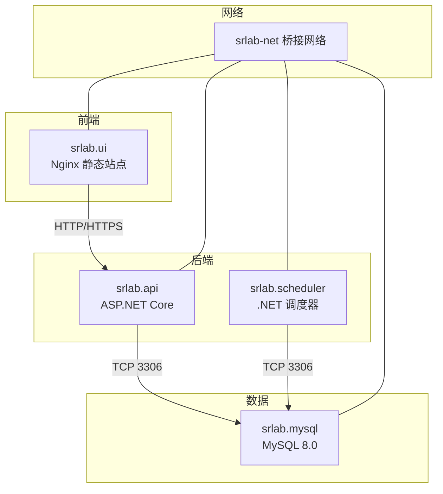
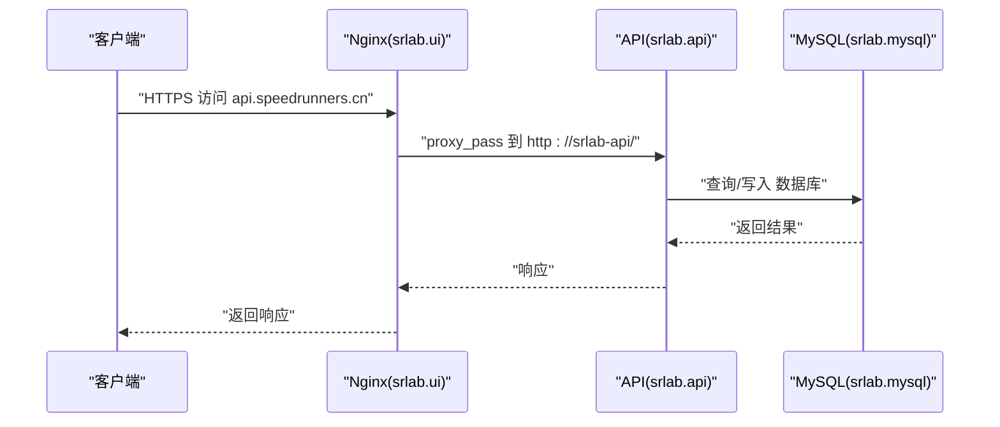
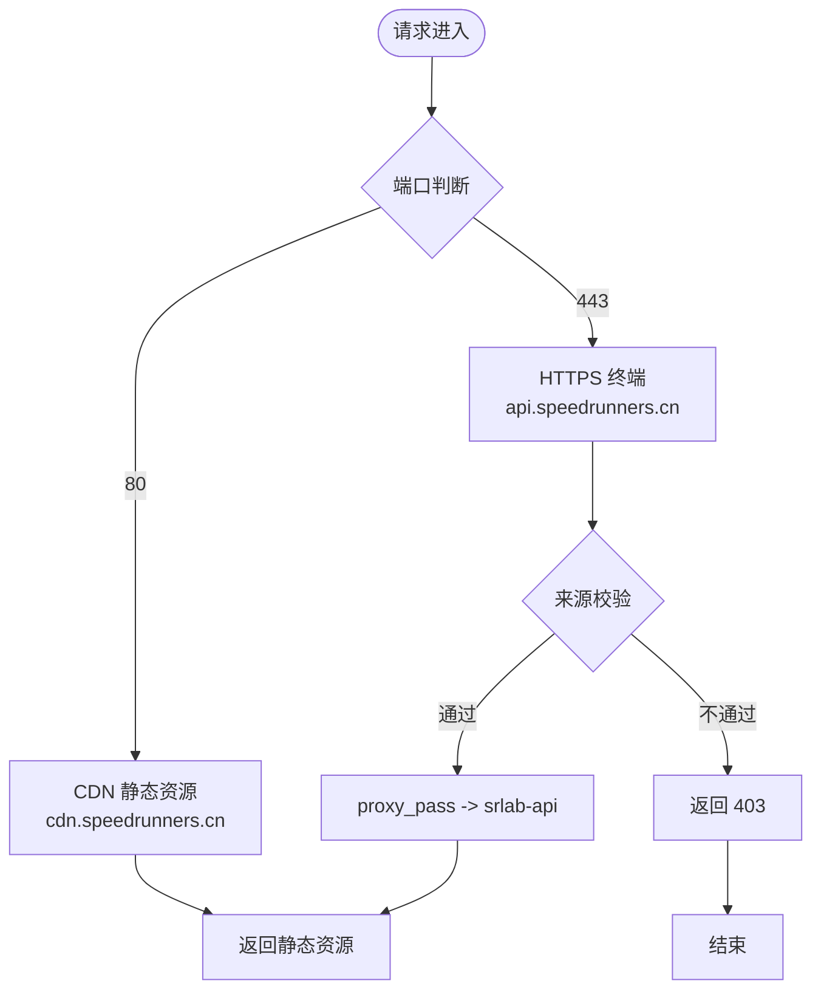
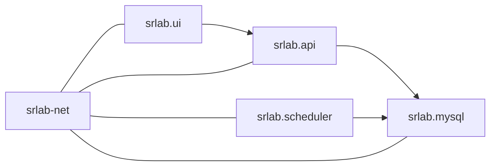

# 部署运维

<cite>
**本文引用的文件**
- [docker-compose.yml](file://docker-compose.yml)
- [SpeedRunners.API/Dockerfile](file://SpeedRunners.API/Dockerfile)
- [SpeedRunners.Scheduler/Dockerfile](file://SpeedRunners.Scheduler/Dockerfile)
- [SpeedRunners.UI/Dockerfile](file://SpeedRunners.UI/Dockerfile)
- [SpeedRunners.UI/nginx/default.conf](file://SpeedRunners.UI/nginx/default.conf)
- [SpeedRunners.API/SpeedRunners/appsettings.json](file://SpeedRunners.API/SpeedRunners/appsettings.json)
- [SpeedRunners.Scheduler/App.config](file://SpeedRunners.Scheduler/App.config)
- [SpeedRunners.UI/.env.production](file://SpeedRunners.UI/.env.production)
- [mysql-dump/tmdsr.sql](file://mysql-dump/tmdsr.sql)
</cite>

## 目录
1. [简介](#简介)
2. [项目结构](#项目结构)
3. [核心组件](#核心组件)
4. [架构总览](#架构总览)
5. [详细组件分析](#详细组件分析)
6. [依赖关系分析](#依赖关系分析)
7. [性能与可用性](#性能与可用性)
8. [故障排查指南](#故障排查指南)
9. [结论](#结论)
10. [附录](#附录)

## 简介
本文件面向 DevOps 工程师与系统管理员，提供 SpeedRunnersLab 的容器化部署与运维实践指南。内容覆盖 Docker 容器化与 docker-compose 编排、Nginx 反向代理与负载均衡策略、生产环境部署流程、环境变量与 secrets 管理、监控与日志、性能与健康检查、数据库备份与版本升级回滚、以及自动化部署与运维脚本使用建议。

## 项目结构
- 后端 API：ASP.NET Core 应用，通过 Dockerfile 构建镜像并由 docker-compose 编排运行。
- 前端 UI：Vue 应用，构建产物置于 Nginx 容器中提供静态服务。
- 调度任务：独立的 .NET Core 运行时应用，用于定时任务与数据同步。
- 数据库：MySQL 8.0，初始化脚本位于 mysql-dump 目录，持久化存储于宿主机目录。
- 反向代理：Nginx 提供 HTTPS 终端、CORS 白名单校验与到后端 API 的反代。

图表来源
- [docker-compose.yml](file://docker-compose.yml#L1-L59)

章节来源
- [docker-compose.yml](file://docker-compose.yml#L1-L59)

## 核心组件
- srlab.mysql
  - 镜像：mysql:8.0.18
  - 端口映射：3306:3306
  - 初始化：挂载 mysql-dump 目录作为初始化 SQL
  - 存储：挂载 ./mysql 到 /var/lib/mysql
  - 环境：ROOT 密码、数据库名、时区
- srlab.api
  - 构建：基于 ./SpeedRunners.API/publish 的产物
  - 入口：dotnet SpeedRunners.dll
  - 网络：加入 srlab-net
  - 主机名：通过 extra_hosts 解析 host.docker.internal
- srlab.ui
  - 构建：基于 nginx:stable-alpine
  - 端口：80/443 映射到宿主机
  - 卷：挂载 Nginx 配置与前端 dist 目录
  - 反代：将 api.speedrunners.cn 反代至 srlab-api
- srlab.scheduler
  - 构建：基于 ./SpeedRunners.Scheduler/publish 的产物
  - 入口：dotnet SpeedRunners.Scheduler.dll
  - 网络：加入 srlab-net
  - 主机名：通过 extra_hosts 解析 host.docker.internal

章节来源
- [docker-compose.yml](file://docker-compose.yml#L4-L18)
- [docker-compose.yml](file://docker-compose.yml#L20-L30)
- [docker-compose.yml](file://docker-compose.yml#L31-L44)
- [docker-compose.yml](file://docker-compose.yml#L46-L55)

## 架构总览
- 外部访问通过 Nginx 接收 HTTP/HTTPS 请求，HTTPS 证书由 UI 侧 Nginx 提供。
- Nginx 对 api.speedrunners.cn 域名进行反向代理，转发到 srlab-api。
- srlab.api 通过连接字符串访问 srlab.mysql。
- srlab.scheduler 以独立容器运行，按计划执行任务（如从 Steam 拉取数据）。

图表来源
- [SpeedRunners.UI/nginx/default.conf](file://SpeedRunners.UI/nginx/default.conf#L11-L25)
- [docker-compose.yml](file://docker-compose.yml#L20-L30)
- [docker-compose.yml](file://docker-compose.yml#L4-L18)

## 详细组件分析

### Nginx 反向代理与负载均衡
- 80 端口监听，server_name 为 cdn.speedrunners.cn，提供静态资源。
- 443 端口监听，server_name 为 api.speedrunners.cn，启用 SSL 并校验来源域名白名单。
- 反向代理到 srlab-api，实现前后端分离。
- 负载均衡：当前 compose 文件未定义多实例，若需横向扩展，可在上游接入 HAProxy/LB 或使用 Docker Swarm/K8s 实现多副本与服务发现。

图表来源
- [SpeedRunners.UI/nginx/default.conf](file://SpeedRunners.UI/nginx/default.conf#L1-L30)

章节来源
- [SpeedRunners.UI/nginx/default.conf](file://SpeedRunners.UI/nginx/default.conf#L1-L30)

### API 应用配置与连接
- 连接字符串：在应用配置中定义，指向 srlab.mysql。
- 日志级别：默认信息级别，可按需调整。
- 代理开关与地址：支持启用内部代理，便于开发或受限网络环境。
- 第三方密钥：Steam API Key、七牛云 AccessKey/SecretKey 等，建议通过 secrets 管理。

章节来源
- [SpeedRunners.API/SpeedRunners/appsettings.json](file://SpeedRunners.API/SpeedRunners/appsettings.json#L1-L21)

### 调度器配置
- 数据库连接：通过 App.config 中的 ConnectionString 指向外部 MySQL。
- 任务参数：包括更新周期、是否启用特定功能等。
- 代理与 API Key：可配置代理地址与接口密钥。

章节来源
- [SpeedRunners.Scheduler/App.config](file://SpeedRunners.Scheduler/App.config#L1-L14)

### 前端构建与运行
- 使用 Nginx 镡像提供静态资源服务。
- 生产环境基础 API 地址指向 api.speedrunners.cn。
- 若需 HTTPS 证书，应确保证书与私钥正确挂载到 Nginx 配置指定路径。

章节来源
- [SpeedRunners.UI/Dockerfile](file://SpeedRunners.UI/Dockerfile#L1-L22)
- [SpeedRunners.UI/.env.production](file://SpeedRunners.UI/.env.production#L1-L7)

### 数据库初始化与持久化
- 初始化：首次启动时会执行 mysql-dump 目录下的 SQL 文件。
- 持久化：/var/lib/mysql 挂载到宿主机 ./mysql，避免容器删除导致数据丢失。

章节来源
- [docker-compose.yml](file://docker-compose.yml#L14-L16)
- [mysql-dump/tmdsr.sql](file://mysql-dump/tmdsr.sql)

## 依赖关系分析
- srlab.api 依赖 srlab.mysql（TCP 3306）。
- srlab.scheduler 依赖 srlab.mysql（TCP 3306）。
- srlab.ui 依赖 srlab.api（通过 Nginx 反代）。
- 所有服务均加入 srlab-net 桥接网络，便于容器间通信。

图表来源
- [docker-compose.yml](file://docker-compose.yml#L3-L59)

章节来源
- [docker-compose.yml](file://docker-compose.yml#L3-L59)

## 性能与可用性
- 健康检查
  - 建议为 srlab.api 添加 HTTP 健康检查端点（如 /health），返回 200 表示健康。
  - 为 srlab.mysql 添加数据库连通性检查。
- 资源限制
  - 为各服务设置 CPU/内存限制，避免资源争抢。
- 负载均衡
  - 当前 compose 未启用多实例；若需高可用，建议引入反向代理层（如 HAProxy/Nginx Plus）或容器编排平台实现多副本与自动扩缩容。
- 缓存与静态资源
  - Nginx 层面开启 Gzip/缓存头，提升静态资源加载性能。
- 日志与追踪
  - API 使用日志配置，建议统一输出到 stdout/stderr，并结合集中式日志系统采集。
  - 调度器日志可通过容器日志采集。

[本节为通用指导，无需列出具体文件来源]

## 故障排查指南
- 无法访问 API
  - 检查 srlab.ui 是否正确将 api.speedrunners.cn 反代到 srlab-api。
  - 检查 srlab.api 是否正常启动且监听 80/443。
- 数据库连接失败
  - 确认 srlab.mysql 已就绪，连接字符串正确，且 srlab.api/srlab.scheduler 可解析到 srlab.mysql。
- CORS/来源校验失败
  - Nginx 对 api.speedrunners.cn 的来源域名做了白名单校验，确保前端来源符合要求。
- 证书问题
  - 确保 /etc/nginx/conf.d/api.speedrunners.cn.pem 与 .key 正确挂载并可读。
- 日志定位
  - 查看对应容器日志，确认错误堆栈与异常时间点。

章节来源
- [SpeedRunners.UI/nginx/default.conf](file://SpeedRunners.UI/nginx/default.conf#L11-L25)
- [docker-compose.yml](file://docker-compose.yml#L20-L30)
- [docker-compose.yml](file://docker-compose.yml#L4-L18)

## 结论
本方案采用 docker-compose 将前端、后端、调度器与数据库解耦编排，配合 Nginx 提供反向代理与静态资源服务。生产环境建议补充 secrets 管理、集中日志、健康检查、负载均衡与多副本部署，并完善数据库备份与版本升级回滚流程，以满足高可用与可维护性需求。

[本节为总结性内容，无需列出具体文件来源]

## 附录

### A. 生产环境部署流程
- 准备阶段
  - 准备 secrets：数据库密码、第三方 API Key、SSL 证书与私钥。
  - 准备持久化卷：确保 ./mysql 与 Nginx 配置卷存在。
- 部署步骤
  - 使用 docker-compose 在目标主机拉起全部服务。
  - 验证 Nginx 反代与证书生效。
  - 验证 API 健康与数据库连通。
  - 验证调度器任务是否按预期执行。
- 回滚策略
  - 保留上一版本镜像标签，必要时回退到历史版本。
  - 如需回滚数据库，使用备份快照恢复。

[本节为通用流程说明，无需列出具体文件来源]

### B. 环境变量与 secrets 管理
- 建议使用 docker-compose 的 secrets 或外部密管（如 HashiCorp Vault、KMS）注入敏感信息。
- 示例字段（请勿直接复制值）：
  - 数据库 ROOT 密码
  - 连接字符串中的用户/密码
  - Steam API Key
  - 七牛云 AccessKey/SecretKey
  - Nginx 证书与私钥

[本节为通用指导，无需列出具体文件来源]

### C. 监控与告警
- 指标采集
  - 容器资源：CPU/内存/IO
  - 应用指标：API 响应时间、错误率、数据库连接数
- 日志采集
  - 统一输出到 stdout/stderr，使用集中式日志系统（如 ELK/Fluent Bit/Loki）采集。
- 告警策略
  - 健康检查失败、错误率突增、数据库不可用、磁盘空间不足等触发告警。

[本节为通用指导，无需列出具体文件来源]

### D. 数据库备份与版本升级
- 备份
  - 使用 mysqldump 或 Percona XtraBackup 定期备份。
  - 将备份归档至对象存储或本地冷存储。
- 升级与回滚
  - 升级前先备份；升级后验证业务可用性。
  - 回滚时使用最近一次可用备份恢复。

[本节为通用指导，无需列出具体文件来源]

### E. 自动化部署与运维脚本
- docker-compose
  - 使用 up/down/restart 等命令管理服务生命周期。
- CI/CD
  - 在流水线中完成构建、推送镜像、拉起新版本、健康检查、滚动回滚。
- 运维脚本建议
  - 备份脚本：定期执行数据库备份。
  - 健康巡检脚本：检查容器状态、端口可达性、数据库连通性。
  - 日志巡检脚本：抓取异常日志并上报。

[本节为通用指导，无需列出具体文件来源]