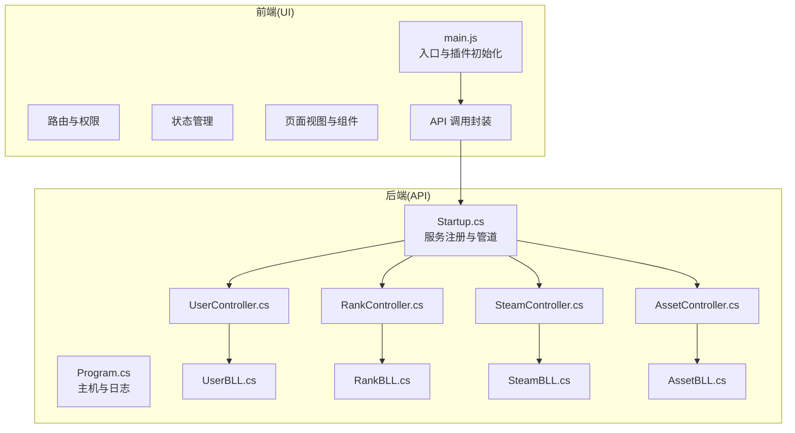
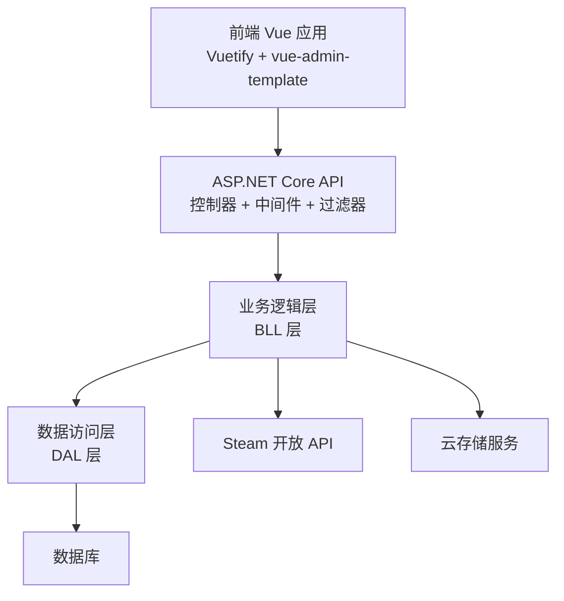
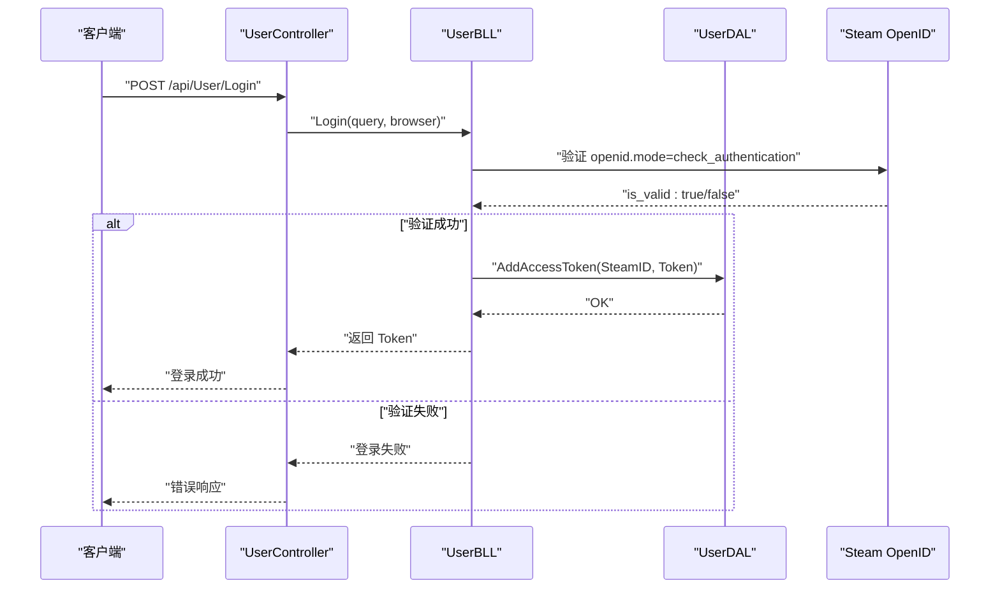
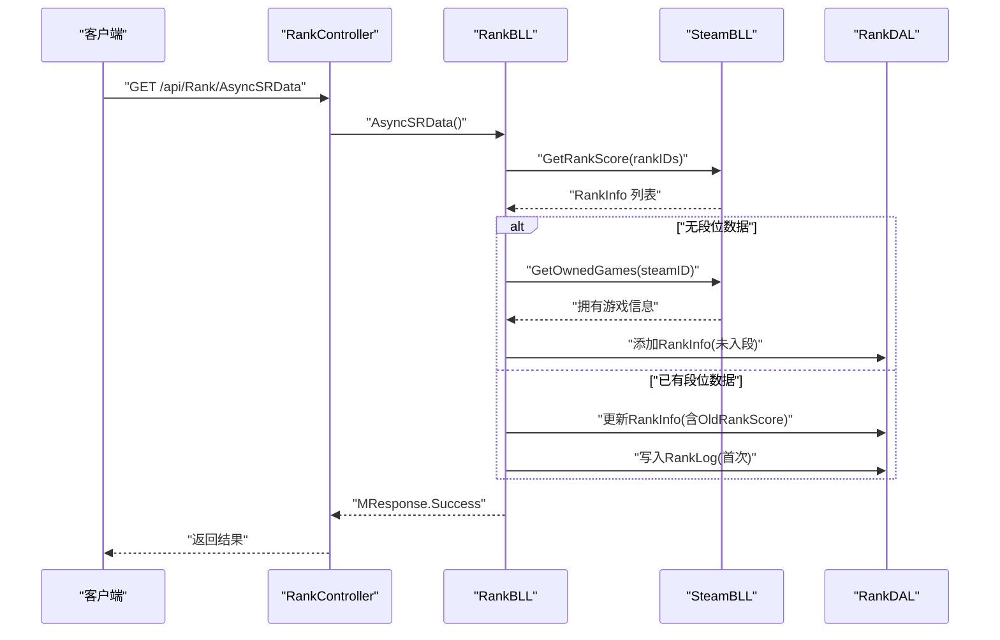
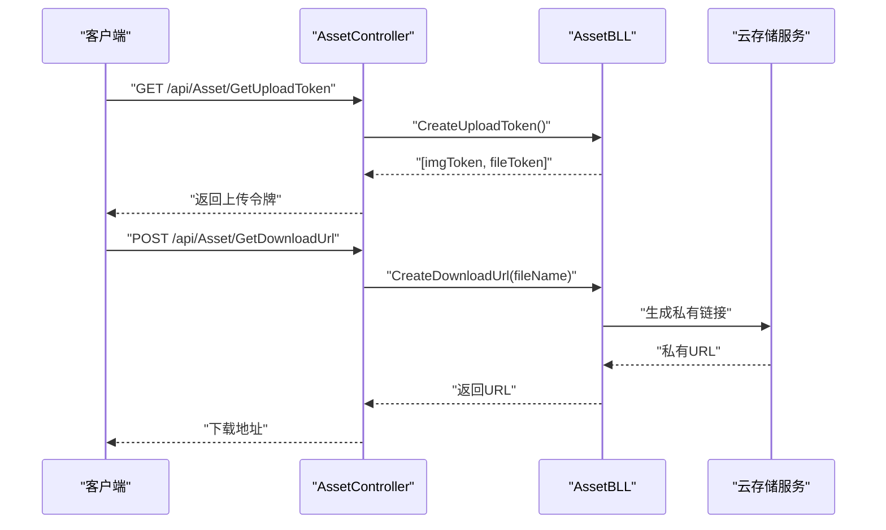
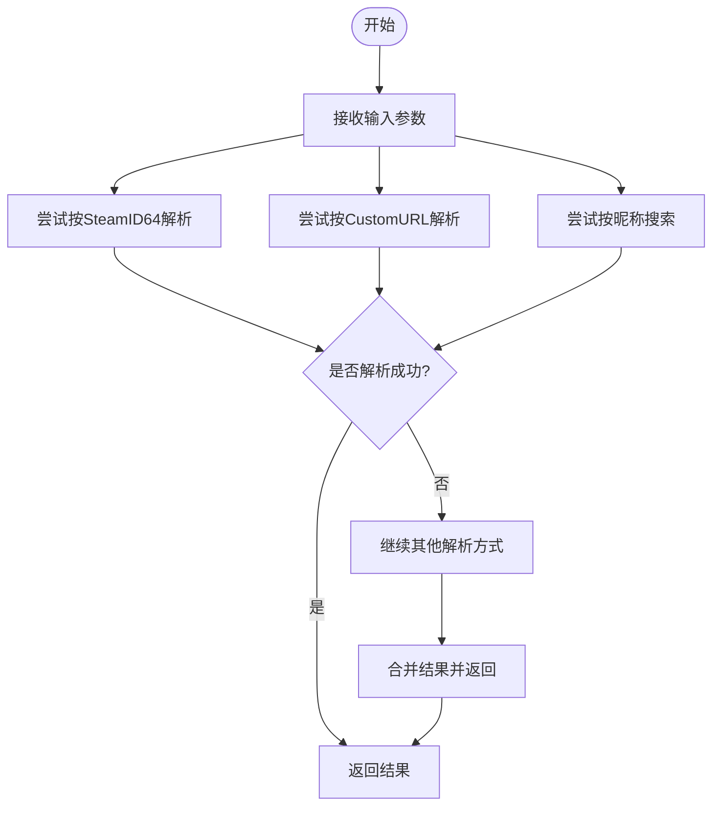
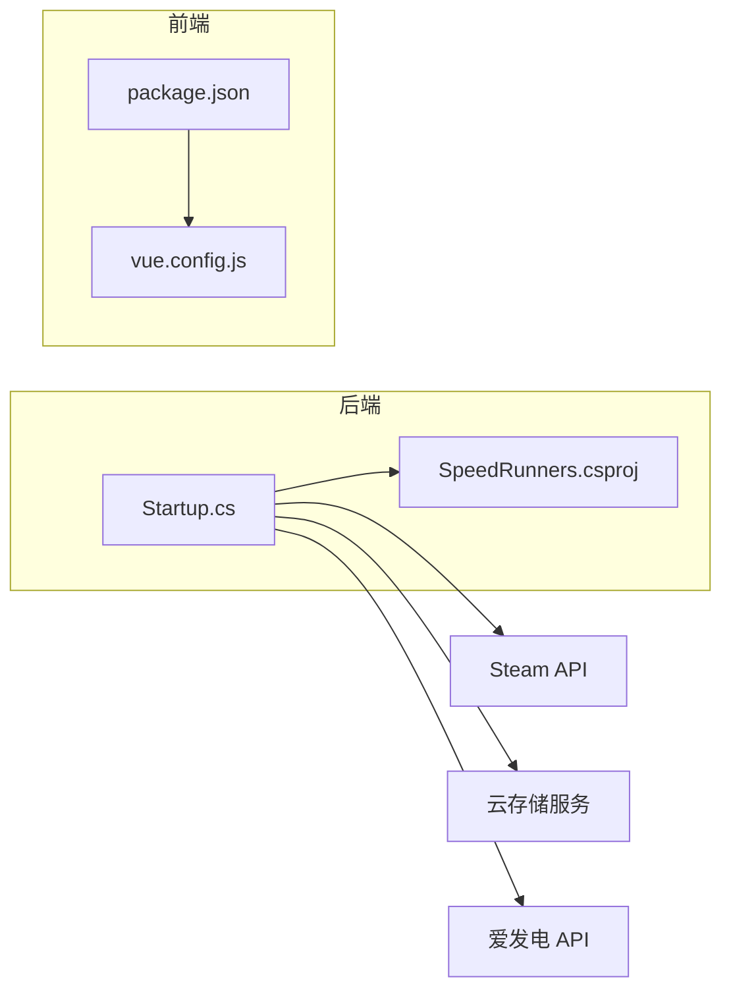

# 项目概述

<cite>
**本文引用的文件**
- [README.md](file://README.md)
- [Startup.cs](file://SpeedRunners.API/SpeedRunners/Startup.cs)
- [Program.cs](file://SpeedRunners.API/SpeedRunners/Program.cs)
- [SpeedRunners.csproj](file://SpeedRunners.API/SpeedRunners/SpeedRunners.csproj)
- [UserController.cs](file://SpeedRunners.API/SpeedRunners/Controllers/UserController.cs)
- [RankController.cs](file://SpeedRunners.API/SpeedRunners/Controllers/RankController.cs)
- [SteamController.cs](file://SpeedRunners.API/SpeedRunners/Controllers/SteamController.cs)
- [AssetController.cs](file://SpeedRunners.API/SpeedRunners/Controllers/AssetController.cs)
- [UserBLL.cs](file://SpeedRunners.API/SpeedRunners.BLL/UserBLL.cs)
- [RankBLL.cs](file://SpeedRunners.API/SpeedRunners.BLL/RankBLL.cs)
- [SteamBLL.cs](file://SpeedRunners.API/SpeedRunners.BLL/SteamBLL.cs)
- [AssetBLL.cs](file://SpeedRunners.API/SpeedRunners.BLL/AssetBLL.cs)
- [package.json](file://SpeedRunners.UI/package.json)
- [main.js](file://SpeedRunners.UI/src/main.js)
- [vue.config.js](file://SpeedRunners.UI/vue.config.js)
</cite>

## 目录
1. [引言](#引言)
2. [项目结构](#项目结构)
3. [核心组件](#核心组件)
4. [架构总览](#架构总览)
5. [详细组件分析](#详细组件分析)
6. [依赖分析](#依赖分析)
7. [性能考虑](#性能考虑)
8. [故障排查指南](#故障排查指南)
9. [结论](#结论)
10. [附录](#附录)

## 引言
SpeedRunnersLab 是一个面向游戏 SpeedRunners 的全栈数据统计与社区平台，采用 ASP.NET Core + Vue.js 技术栈构建，结合 Vuetify + vue-admin-template 前端框架与 Steam 开放 API，提供用户管理、Steam 集成、实时排名统计、MOD 管理与分享、在线人数查询、赞助商展示等功能。项目目标是为 SpeedRunners 玩家提供权威的数据统计、便捷的 MOD 分发渠道以及活跃的社区互动。

本项目的技术选型兼顾易用性与可维护性：前端以 Vue 2 + Vuetify 快速搭建界面与交互；后端以 ASP.NET Core 提供稳定的服务层与中间件生态；Steam API 用于获取玩家与游戏数据；数据库访问层采用轻量 ORM；文件存储通过云存储服务实现 MOD 与图片资源的上传下载。

## 项目结构
项目采用多项目解决方案（Solution）组织，分为三个主要工程与一个静态资源目录：
- 后端 API 工程：SpeedRunners.API，包含控制器、业务逻辑层（BLL）、数据访问层（DAL）、模型与工具库，以及启动与配置文件。
- 业务逻辑层（BLL）：封装业务规则与第三方 API 调用，协调 DAL 与外部服务。
- 数据访问层（DAL）：负责数据库读写与事务控制。
- 工具库（Utils）：提供通用工具类，如 HTTP 请求、签名生成、数据库连接等。
- 前端工程：SpeedRunners.UI，基于 Vue 2 + Vuetify 构建，包含路由、状态管理、国际化、权限控制与页面视图。
- 定时任务工程：SpeedRunners.Scheduler，用于定时抓取与更新数据（非本次概述重点）。

图表来源
- [main.js](file://SpeedRunners.UI/src/main.js#L1-L30)
- [Startup.cs](file://SpeedRunners.API/SpeedRunners/Startup.cs#L33-L84)
- [UserController.cs](file://SpeedRunners.API/SpeedRunners/Controllers/UserController.cs#L10-L57)
- [RankController.cs](file://SpeedRunners.API/SpeedRunners/Controllers/RankController.cs#L11-L47)
- [SteamController.cs](file://SpeedRunners.API/SpeedRunners/Controllers/SteamController.cs#L8-L27)
- [AssetController.cs](file://SpeedRunners.API/SpeedRunners/Controllers/AssetController.cs#L12-L46)

章节来源
- [README.md](file://README.md#L1-L5)
- [package.json](file://SpeedRunners.UI/package.json#L15-L33)
- [vue.config.js](file://SpeedRunners.UI/vue.config.js#L23-L57)

## 核心组件
- 用户管理与认证
  - 控制器：UserController 提供登录、登出、隐私设置、状态与段位类型设置等接口。
  - 业务层：UserBLL 实现 Steam OpenID 登录校验、令牌发放与刷新、多端会话管理。
- 排行统计
  - 控制器：RankController 提供排行榜、新增积分趋势、小时排行、异步拉取数据、初始化用户数据、参与活动开关、赞助商列表等接口。
  - 业务层：RankBLL 负责聚合 Steam 与自定义数据，计算评分与周时长等指标，并与 SteamBLL 协作获取段位与玩家信息。
- Steam 集成
  - 控制器：SteamController 提供玩家搜索、按 URL/SteamID 解析、在线人数查询等接口。
  - 业务层：SteamBLL 封装 Steam Web API 与 Doubledutch Games 的 SpeedRunners 排行接口，支持中文统计项翻译。
- MOD 管理
  - 控制器：AssetController 提供上传令牌、下载地址、MOD 列表、详情、新增、点赞/取消、删除、赞助商查询等接口。
  - 业务层：AssetBLL 负责七牛云上传/下载签名、资源删除、MOD 信息持久化与展示。
- 前端
  - 使用 Vuetify + vue-admin-template，集成路由、Vuex、Vue-i18n、权限控制与图标系统，构建仪表盘式界面。

章节来源
- [UserController.cs](file://SpeedRunners.API/SpeedRunners/Controllers/UserController.cs#L10-L57)
- [UserBLL.cs](file://SpeedRunners.API/SpeedRunners.BLL/UserBLL.cs#L60-L93)
- [RankController.cs](file://SpeedRunners.API/SpeedRunners/Controllers/RankController.cs#L13-L47)
- [RankBLL.cs](file://SpeedRunners.API/SpeedRunners.BLL/RankBLL.cs#L28-L96)
- [SteamController.cs](file://SpeedRunners.API/SpeedRunners/Controllers/SteamController.cs#L10-L26)
- [SteamBLL.cs](file://SpeedRunners.API/SpeedRunners.BLL/SteamBLL.cs#L28-L82)
- [AssetController.cs](file://SpeedRunners.API/SpeedRunners/Controllers/AssetController.cs#L14-L46)
- [AssetBLL.cs](file://SpeedRunners.API/SpeedRunners.BLL/AssetBLL.cs#L22-L47)
- [main.js](file://SpeedRunners.UI/src/main.js#L1-L30)

## 架构总览
系统采用经典的三层架构（UI -> API -> BLL/DAL），并引入中间件与过滤器增强安全性与统一响应格式。前端通过 Axios 发起请求，后端通过控制器接收请求，业务层执行领域逻辑，数据层完成持久化操作。Steam API 与云存储服务作为外部依赖被业务层统一调用。

图表来源
- [Startup.cs](file://SpeedRunners.API/SpeedRunners/Startup.cs#L33-L84)
- [SpeedRunners.csproj](file://SpeedRunners.API/SpeedRunners/SpeedRunners.csproj#L16-L29)
- [UserBLL.cs](file://SpeedRunners.API/SpeedRunners.BLL/UserBLL.cs#L60-L93)
- [RankBLL.cs](file://SpeedRunners.API/SpeedRunners.BLL/RankBLL.cs#L102-L155)
- [SteamBLL.cs](file://SpeedRunners.API/SpeedRunners.BLL/SteamBLL.cs#L28-L82)
- [AssetBLL.cs](file://SpeedRunners.API/SpeedRunners.BLL/AssetBLL.cs#L22-L47)

## 详细组件分析

### 用户认证与会话流程
该流程涵盖 Steam OpenID 校验、令牌签发、多端会话管理与登出。

图表来源
- [UserController.cs](file://SpeedRunners.API/SpeedRunners/Controllers/UserController.cs#L43-L47)
- [UserBLL.cs](file://SpeedRunners.API/SpeedRunners.BLL/UserBLL.cs#L60-L93)

章节来源
- [UserController.cs](file://SpeedRunners.API/SpeedRunners/Controllers/UserController.cs#L43-L57)
- [UserBLL.cs](file://SpeedRunners.API/SpeedRunners.BLL/UserBLL.cs#L60-L150)

### 排行榜与数据同步流程
该流程从 Steam 获取段位与玩家信息，结合本地数据进行初始化与增量更新。

图表来源
- [RankController.cs](file://SpeedRunners.API/SpeedRunners/Controllers/RankController.cs#L28-L32)
- [RankBLL.cs](file://SpeedRunners.API/SpeedRunners.BLL/RankBLL.cs#L161-L191)
- [SteamBLL.cs](file://SpeedRunners.API/SpeedRunners.BLL/SteamBLL.cs#L52-L82)

章节来源
- [RankController.cs](file://SpeedRunners.API/SpeedRunners/Controllers/RankController.cs#L13-L47)
- [RankBLL.cs](file://SpeedRunners.API/SpeedRunners.BLL/RankBLL.cs#L102-L191)
- [SteamBLL.cs](file://SpeedRunners.API/SpeedRunners.BLL/SteamBLL.cs#L52-L82)

### MOD 上传与下载流程
该流程通过云存储服务生成上传/下载签名，完成资源的上传与安全访问。

图表来源
- [AssetController.cs](file://SpeedRunners.API/SpeedRunners/Controllers/AssetController.cs#L16-L22)
- [AssetController.cs](file://SpeedRunners.API/SpeedRunners/Controllers/AssetController.cs#L20-L22)
- [AssetBLL.cs](file://SpeedRunners.API/SpeedRunners.BLL/AssetBLL.cs#L22-L47)

章节来源
- [AssetController.cs](file://SpeedRunners.API/SpeedRunners/Controllers/AssetController.cs#L14-L46)
- [AssetBLL.cs](file://SpeedRunners.API/SpeedRunners.BLL/AssetBLL.cs#L22-L91)

### Steam 搜索与解析流程
该流程支持多种输入方式（关键词、CustomURL、SteamID64），并返回玩家信息或游戏统计。

图表来源
- [SteamController.cs](file://SpeedRunners.API/SpeedRunners/Controllers/SteamController.cs#L12-L22)
- [SteamBLL.cs](file://SpeedRunners.API/SpeedRunners.BLL/SteamBLL.cs#L113-L135)
- [SteamBLL.cs](file://SpeedRunners.API/SpeedRunners.BLL/SteamBLL.cs#L214-L237)

章节来源
- [SteamController.cs](file://SpeedRunners.API/SpeedRunners/Controllers/SteamController.cs#L10-L26)
- [SteamBLL.cs](file://SpeedRunners.API/SpeedRunners.BLL/SteamBLL.cs#L113-L237)

## 依赖分析
- 后端依赖
  - ASP.NET Core MVC、Newtonsoft.Json、日志组件、Kestrel 服务器、本地化与跨域策略。
  - 项目引用 BLL、Utils、Model，体现清晰的分层与解耦。
- 前端依赖
  - Vue 2、Vuetify、Vue Router、Vuex、Vue-i18n、Axios、ECharts 等，构建现代化单页应用。
- 外部服务
  - Steam 开放 API：玩家信息、游戏统计、在线人数。
  - 云存储服务：七牛云，用于 MOD 文件与图片资源的上传与私有链接下载。
  - 赞助商接口：爱发电开放 API，用于赞助商信息查询。

图表来源
- [SpeedRunners.csproj](file://SpeedRunners.API/SpeedRunners/SpeedRunners.csproj#L16-L29)
- [package.json](file://SpeedRunners.UI/package.json#L15-L33)
- [SteamBLL.cs](file://SpeedRunners.API/SpeedRunners.BLL/SteamBLL.cs#L20-L33)
- [AssetBLL.cs](file://SpeedRunners.API/SpeedRunners.BLL/AssetBLL.cs#L18-L36)
- [AssetBLL.cs](file://SpeedRunners.API/SpeedRunners.BLL/AssetBLL.cs#L162-L200)

章节来源
- [SpeedRunners.csproj](file://SpeedRunners.API/SpeedRunners/SpeedRunners.csproj#L16-L29)
- [package.json](file://SpeedRunners.UI/package.json#L15-L33)

## 性能考虑
- 前端
  - 代码分割与运行时优化：通过拆分第三方库与公共组件，减少首屏体积；生产环境启用运行时分包与内联运行时脚本，提升加载效率。
  - 资源版本化：构建时注入版本号，避免浏览器缓存导致的资源不一致。
- 后端
  - 控制器层统一异常与响应过滤器，减少重复逻辑；启用本地化与跨域策略，保证前后端协作顺畅。
  - 数据访问层使用事务控制与批量处理，降低数据库压力。
- 外部服务
  - Steam API 请求采用并发与超时控制，避免阻塞；MOD 下载使用私有链接与计数统计，保障资源安全与访问追踪。

章节来源
- [vue.config.js](file://SpeedRunners.UI/vue.config.js#L96-L126)
- [Startup.cs](file://SpeedRunners.API/SpeedRunners/Startup.cs#L33-L62)
- [RankBLL.cs](file://SpeedRunners.API/SpeedRunners.BLL/RankBLL.cs#L144-L154)

## 故障排查指南
- 登录失败
  - 检查 Steam OpenID 验证返回值与网络连通性；确认浏览器标识与用户代理头是否正确传递。
  - 参考路径：[UserBLL.cs](file://SpeedRunners.API/SpeedRunners.BLL/UserBLL.cs#L60-L93)
- 数据同步异常
  - 确认 Steam API Key 配置与接口可用性；检查段位接口返回格式与字段映射。
  - 参考路径：[RankBLL.cs](file://SpeedRunners.API/SpeedRunners.BLL/RankBLL.cs#L161-L191)、[SteamBLL.cs](file://SpeedRunners.API/SpeedRunners.BLL/SteamBLL.cs#L52-L82)
- MOD 上传/下载失败
  - 校验云存储密钥与空间配置；确认上传/下载签名生成逻辑与过期时间。
  - 参考路径：[AssetBLL.cs](file://SpeedRunners.API/SpeedRunners.BLL/AssetBLL.cs#L22-L47)
- CORS 或本地化问题
  - 检查 Startup 中跨域策略与本地化资源路径配置。
  - 参考路径：[Startup.cs](file://SpeedRunners.API/SpeedRunners/Startup.cs#L35-L59)

章节来源
- [UserBLL.cs](file://SpeedRunners.API/SpeedRunners.BLL/UserBLL.cs#L60-L93)
- [RankBLL.cs](file://SpeedRunners.API/SpeedRunners.BLL/RankBLL.cs#L161-L191)
- [SteamBLL.cs](file://SpeedRunners.API/SpeedRunners.BLL/SteamBLL.cs#L52-L82)
- [AssetBLL.cs](file://SpeedRunners.API/SpeedRunners.BLL/AssetBLL.cs#L22-L47)
- [Startup.cs](file://SpeedRunners.API/SpeedRunners/Startup.cs#L35-L59)

## 结论
SpeedRunnersLab 以清晰的分层架构与成熟的开源生态为基础，实现了从用户认证、数据统计到 MOD 管理的完整闭环。前后端分离的设计便于扩展与维护，Steam API 与云存储服务的集成提升了数据与资源的可靠性。建议后续持续完善测试体系、监控告警与部署自动化，以进一步提升系统的稳定性与可运维性。

## 附录
- 技术栈说明
  - 前端：Vue 2 + Vuetify + vue-admin-template，提供现代化 UI 与权限控制。
  - 后端：ASP.NET Core，提供稳定的 Web API 与中间件生态。
  - 数据库：通过 DAL 层抽象，适配 MySQL 等关系型数据库。
  - 外部服务：Steam 开放 API、云存储服务、爱发电开放 API。
- 项目启动与开发
  - 前端：安装依赖后运行开发服务器，支持热重载与预览。
  - 后端：通过 Program/Startup 启动 Kestrel，配置日志与跨域策略。

章节来源
- [README.md](file://README.md#L1-L5)
- [package.json](file://SpeedRunners.UI/package.json#L6-L13)
- [Program.cs](file://SpeedRunners.API/SpeedRunners/Program.cs#L14-L30)
- [Startup.cs](file://SpeedRunners.API/SpeedRunners/Startup.cs#L65-L84)